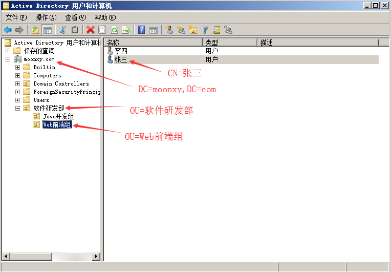

LDAP（Lightweight Directory Access Protocol，轻量目录访问协议），是一种用来查询与更新 Active Directory 的目录服务通信协议。AD 域服务利用 LDAP 命名路径（LDAP naming path）来表示对象在 AD 内的位置，以便用它来访问 AD 内的对象。

LDAP名称路径如下：

**标识名称（distinguished Name，DN）**：它是对象在 Active Directory 内的完整路径，**DN** 有三个属性，分别是 **CN，OU，DC**。

**DC (Domain Component)：域名组件；**

**CN (Common Name)：\**通用名称，一般为用户名或计算机名；\****

**OU (Organizational Unit)：\**组织单位；\****

例如，如上用户账户，其 DN 为：

CN=张三,OU=Web前端组,OU=软件开发部,DC=moonxy,DC=com

其中 **DC（Domain Component）**表示 DNS 域名中的组件，例如 moonxy.com 中的 moonxy 与 com；**OU为组织单位（Organization Unit）**；**CN为通用名称（Common Name）\**，一般为用户名或服务器名\****。除了DC与OU之外，其他都利用CN来表示，例如用户与计算机对象都属于CN。上述DN表示法中的 moonxy.com 为域名，软件研发部、Web前端组都是组织单位。此 DN 表示账户张三存储在 **moonxy.com\软件研发部\Web前端组**路径中。

**相对标识名称（Relative Distinguished Name，RDN）**：RDN用来代表DN完整路径中的部分路径，例如上面路径中的 CN=张三与 OU=Web前端组等都是 RDN。

**Base DN**：LDAP 目录树的最顶部就是根，也就是所谓的 "Base DN"，如 "DC=moonxy,DC=com"。

除了 DN 与 RDN 这两个对象名称外，另外还有如下两个名称：

**全局唯一标识符（Global Unique Identifier，GUID）**：GUID 是一个128位的数值，系统会自动为每个对象指定一个唯一的GUID。虽然可以改变对象的名称，但是其GUID永远不会改变。

**用户主体名称（User Principal Name，UPN）**：每个用户还可以有一个比DN更短、更容易记忆的 UPN，例如上面的张三隶属于 moonxy.com，则其 UPN 可以为 zhangsan@moonxy.com等与DC、OU无关的ID。用户登录时所输入的账户名最好是 UPN，因为无论此用户的账户被移动到哪一个域，其 UPN 都不会改变，因此用户可以一直使用同一个名称来登录。

**AD 与 LDAP 的关系**：LDAP 是一种用来访问 AD 数据库的目录服务协议，AD DS 会通过 LDAP 名称路径来表示对象在 AD 数据库中的位置，以便用它来访问 AD 数据库内的对象。LDAP 的名称路径包括有 DN、RDN。

**openLDAP（Linux），Active Directory（Microsoft）**等是对 LDAP 目录访问协议的具体实现，除了实现协议的功能，还对它进行了扩展。