卡刷 zip

线刷 tgz

参考视频

https://www.bilibili.com/video/BV1Ly4y1u7YE?share_source=copy_web

## 1.Unlock Bootloader Lock

若小米官方手机解锁工具报错无法连接手机，设备管理器也显示驱动没装好的话，

1.去设备管理器里点击手机更新

2.更新驱动

3.找到MiUsbDriver.exe并安装

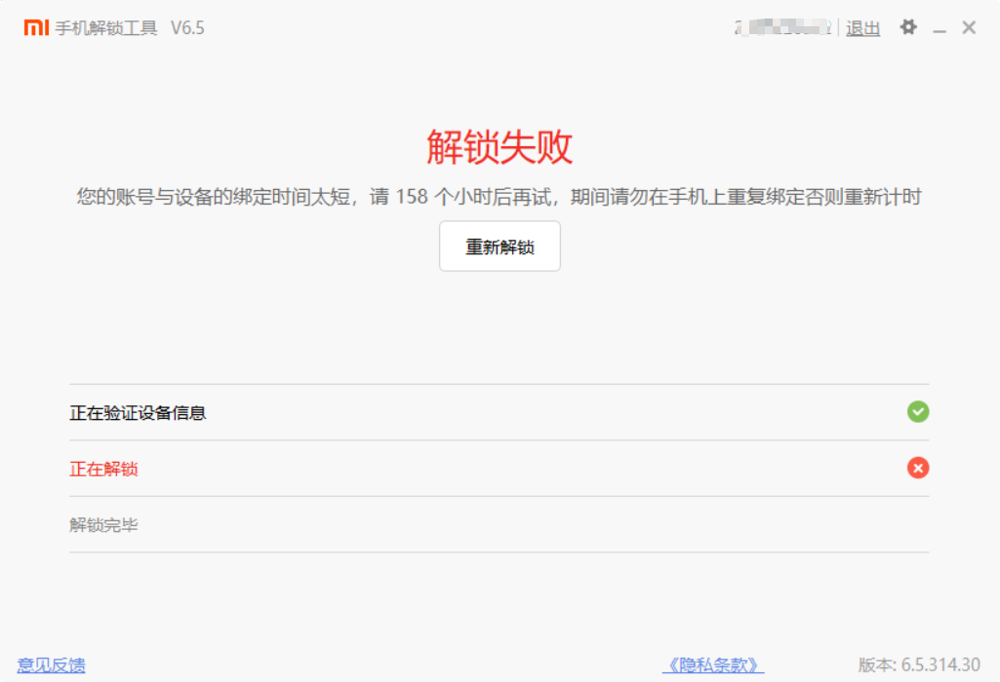

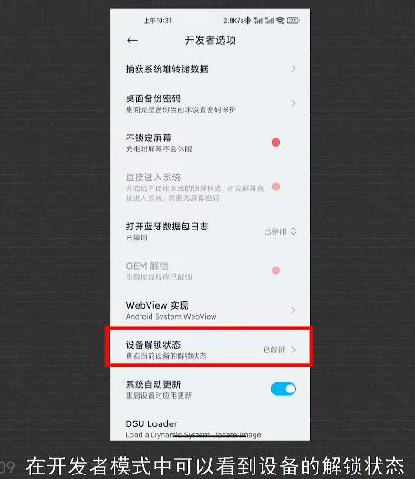

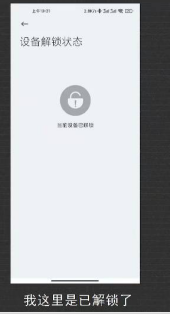

## 2.安装第三方REC

REC=recovery

### twrp

Made by 微博@wzsx150

若找红米REC，可直接点击微博任意一篇红米推文里的云盘链接，里面有所有@wzsx150制作的红米REC，但新的红米型号囊括不全。

天翼云盘也有破解版

### 橙狐REC

下载完压缩包后在win解压

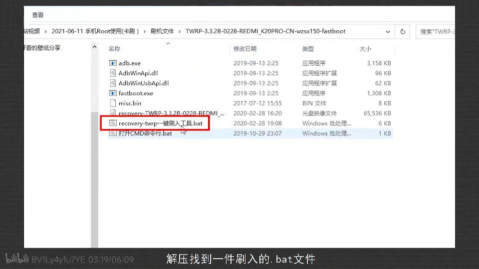

手机连接电脑

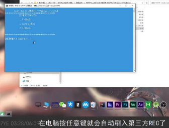

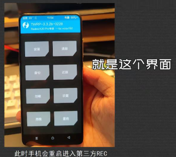

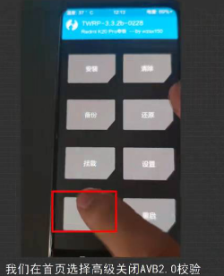

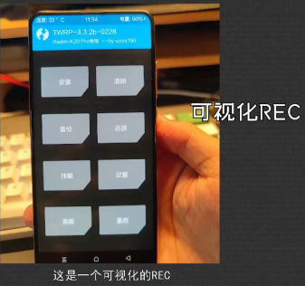

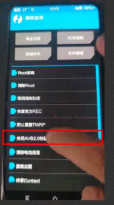

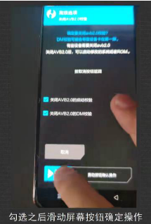

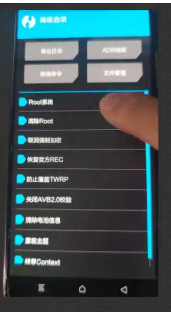

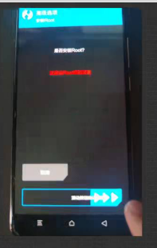

## 3.刷入Magisk

此步就是root

将卡刷包里的payload.bin复制到payload_dumper-win64的payload_input里

运行payload_dumper.exe，会在payload_output生成boot.img。将boot.img复制到手机里。

打开Magisk针对boot.img进行修补。

将download文件夹里修补好的img放入adb文件夹里。

将文件名修改位boot.img.

Enter FastBoot
