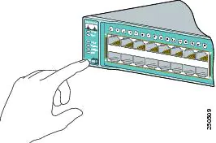

摘抄来源：[Catalyst 3560 Switch Getting Started Guide - Cisco](https://www.cisco.com/c/en/us/td/docs/switches/lan/catalyst3560/hardware/quick/guide/3560gsg_08.html#wp49930)

> ### Resetting the Switch
>
> Why you might want to reset the switch:
>
> •You installed the switch in your network and cannot connect to it because you assigned the wrong IP address.
>
> •You want to clear all configuration from the switch and assign a new IP address.
>
> •You are trying to enter Express Setup mode, and the switch LEDs start blinking when you press the Mode button, which means that the switch is already configured with IP information.
>
> **Caution** Resetting the switch deletes the configuration and reboots the switch.
>
> 
>
> To reset the switch, press and hold the Mode button. The switch LEDs begin blinking after about 3 seconds. Continue holding down the Mode button. The LEDs stop blinking after 7 more seconds, and then the switch reboots.(这时候也可以松手了)

| Step 3 | When the switch powers on, it begins the power-on self-test (POST), and the LEDs blink. Wait for the switch to complete POST, which can take several minutes. |
| ------ | ------------------------------------------------------------ |
| Step 4 | Verify that POST has completed by confirming that the SYST LED is green. If the switch fails POST, the SYST LED turns amber. Contact your Cisco technical support representative if this happens. |
| Step 5 | Press and hold the Mode button for 3 seconds. When all LEDs above the Mode button are green, release it.If the LEDs above the Mode button begin to blink after you press the button, release it. Blinking LEDs mean that the switch has already been configured and cannot go into Express Setup mode. For more information, see the ["Resetting the Switch" section](https://www.cisco.com/c/en/us/td/docs/switches/lan/catalyst3560/hardware/quick/guide/3560gsg_08.html#wp46478). |

我第一次尝试的时候，在reboot过程中出了些问题。

 SYST LED一直闪烁超过10min，证明POST出了问题。然后我又断电重启，顺利进入。