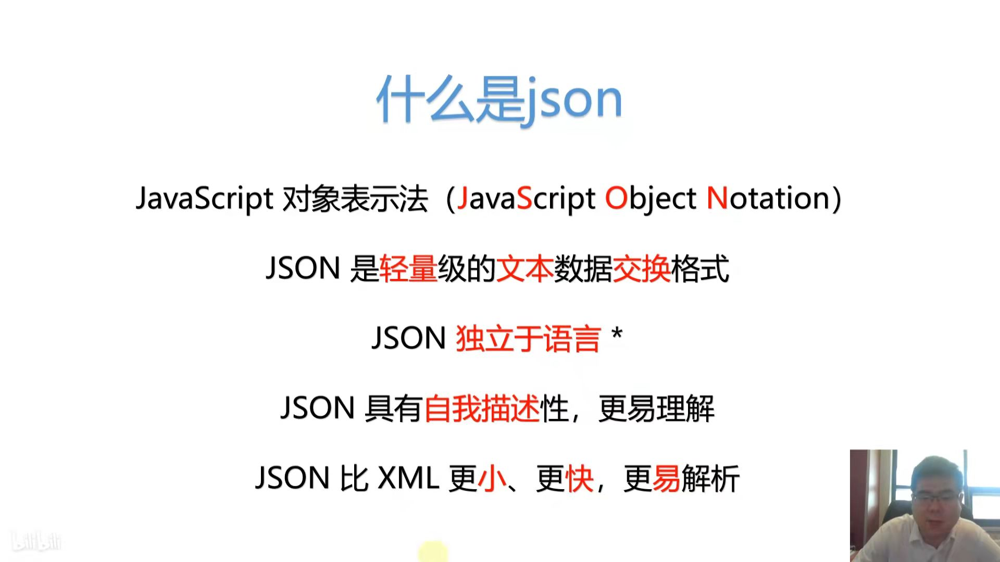
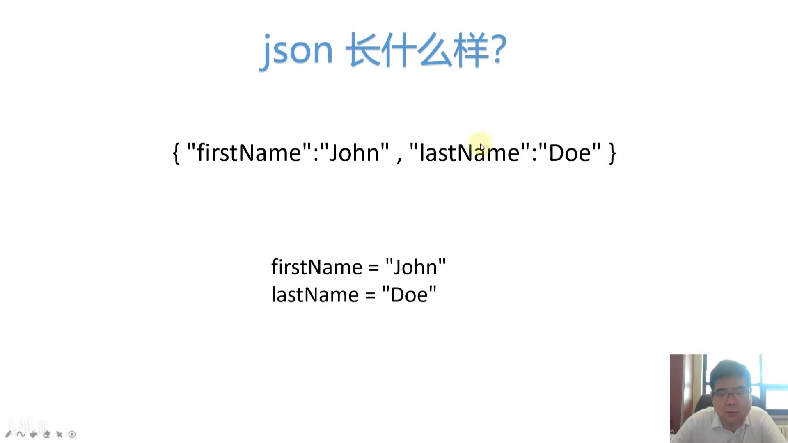
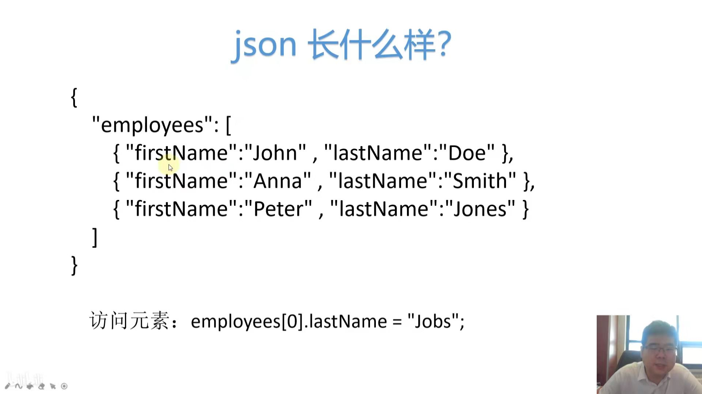
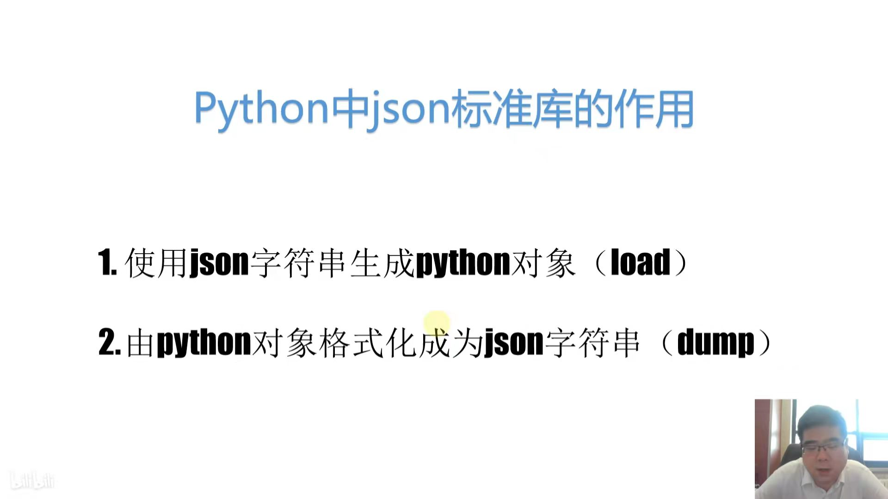
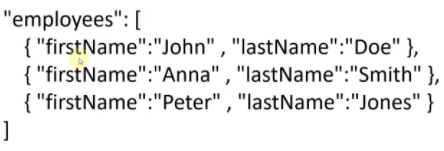
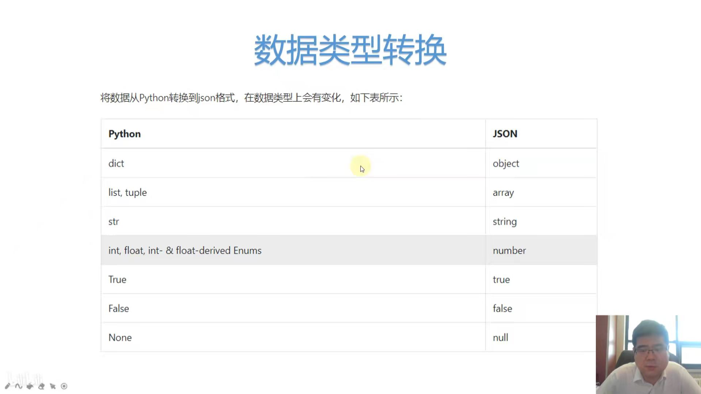
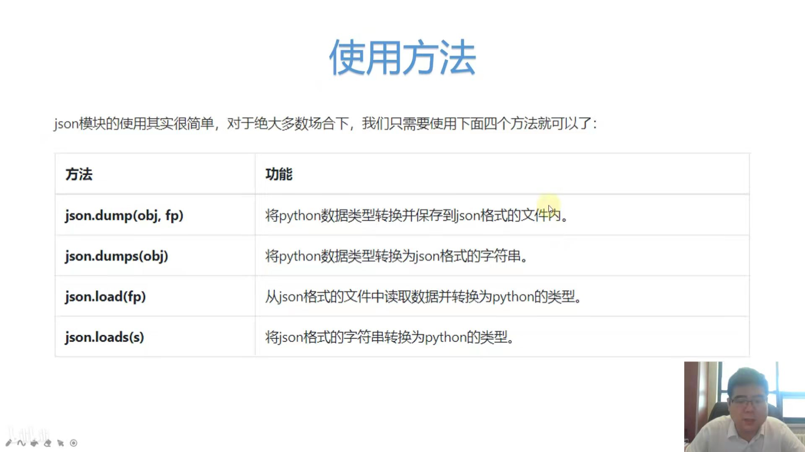

Json并非Js特有的，只是历史上Json和js有一段渊源。

json比xml更轻量。



上图为最基本的对象（Object）的描述方式。



上图将3个对象封装成employees属性



一般我们用json生成python 的字典或者列表。


若是只有`[ ]`,最外层非`{ }`（如下图所示），则在python会解析成list。







在python里，字典的key输出结果的`”`都会转变为`'`。


dumps的意思是dump string


```python
import json
person = {"name" : "Sniper" , "age":30 , "tel":["1231231456","15653"],"Is Only Child":True}
print(json.dumps(person))
jsonStr = json.dumps(person,indent=4,sort_keys=True)   
#indent能美化json格式，indent的值可以改变;
#sort_keys能将json排序，大写字母最先，其次是数字，接着是小写字母
print(jsonStr)
print(type(jsonStr))

json.dump(person,open('data.json','w'),indent=4,sort_keys=True)

S = '{"name" : "Sniper" , "age":30 , "tel":["1231231456","15653"],"Is Only Child":true}'
Python_Obj = json.loads(S)
print(Python_Obj)
print(type(Python_Obj))

s = '["A",2,"age",{"f":true,"l":"Sniper"}]'
Python_Obj = json.loads(s)
print(Python_Obj)
print(type(Python_Obj))

Python_Obj = json.load(open('employees.json','r'))
print(Python_Obj)
print(type(Python_Obj))
```

