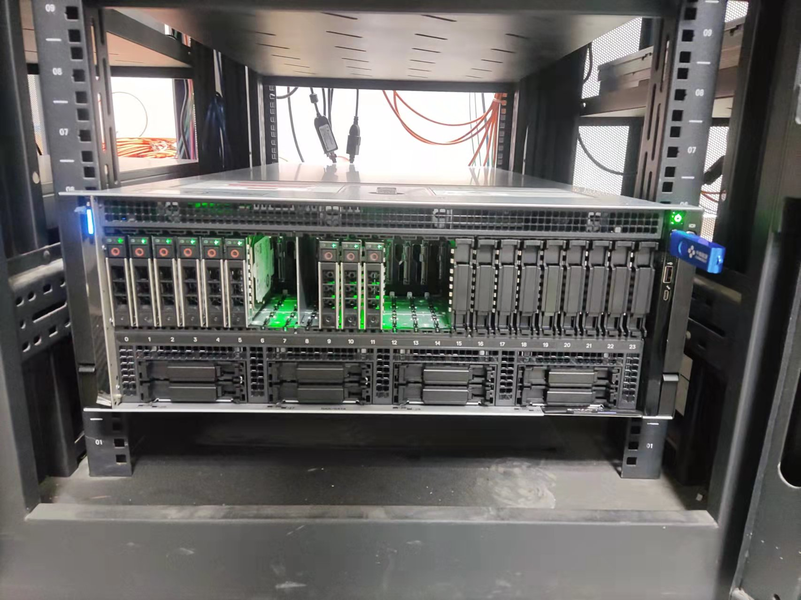
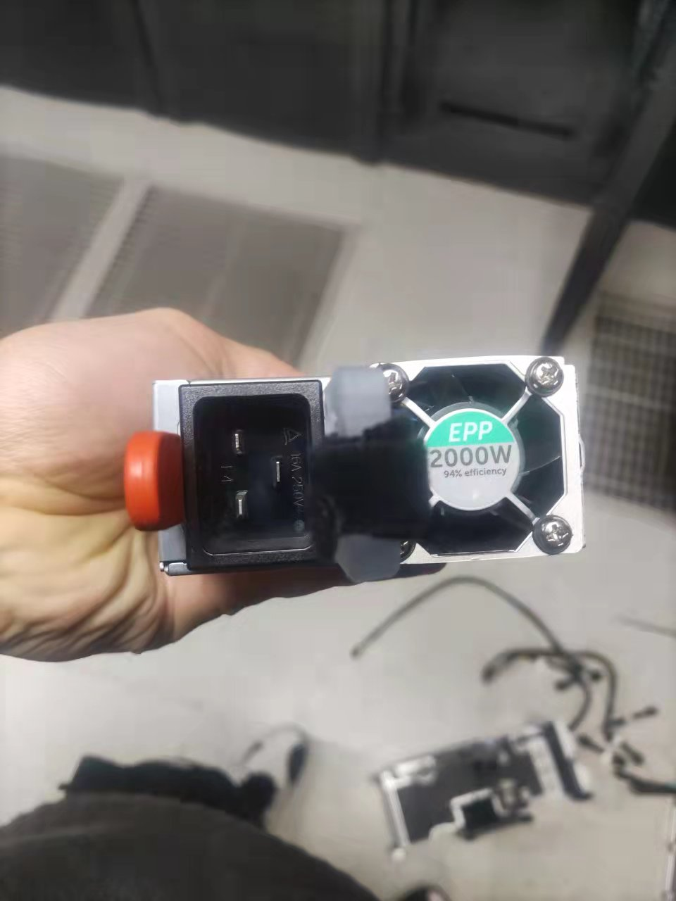
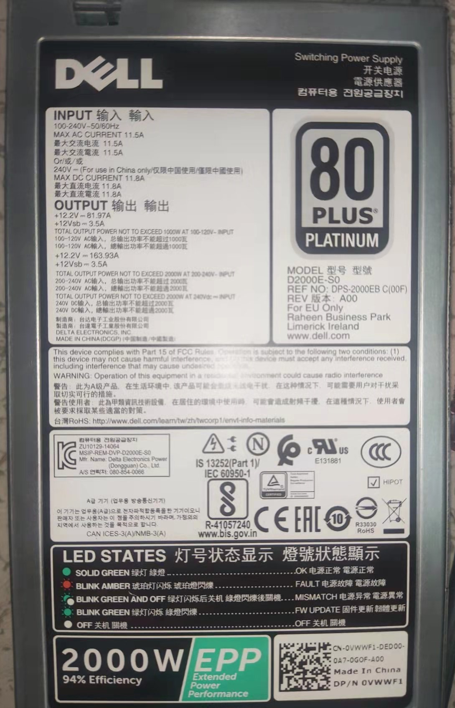
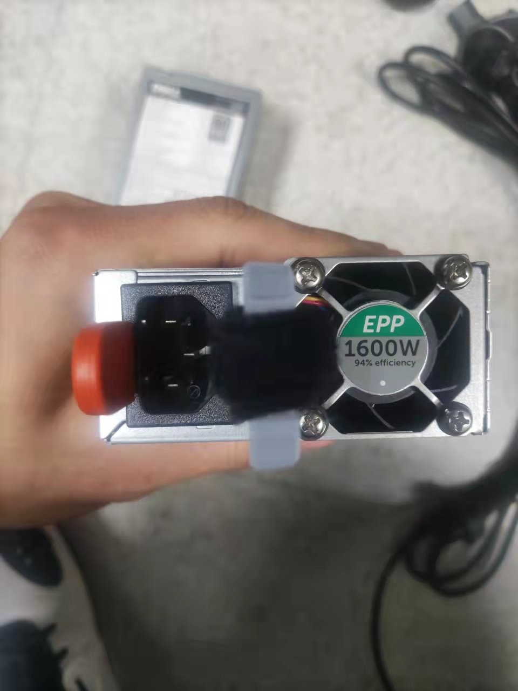
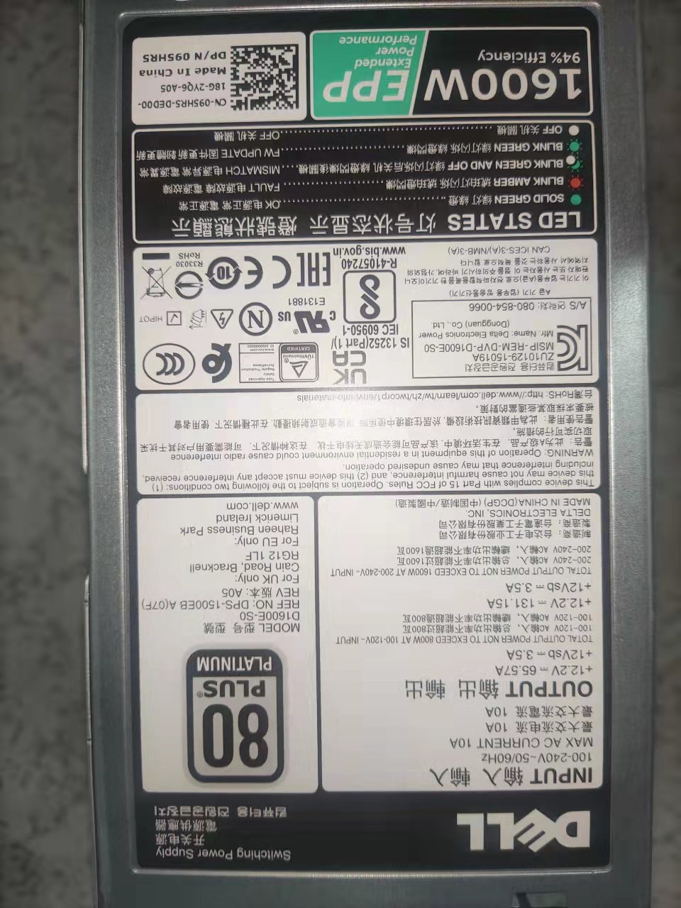
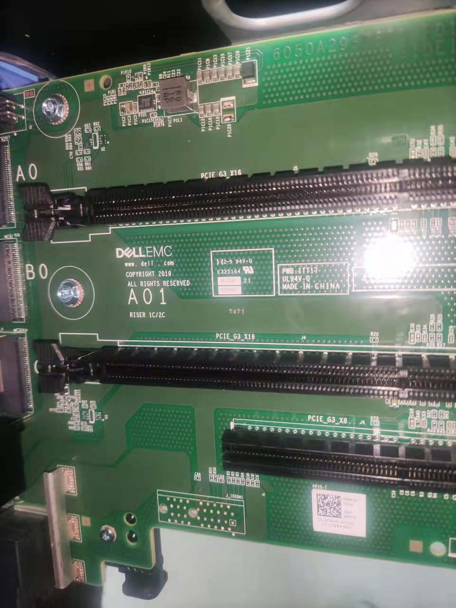
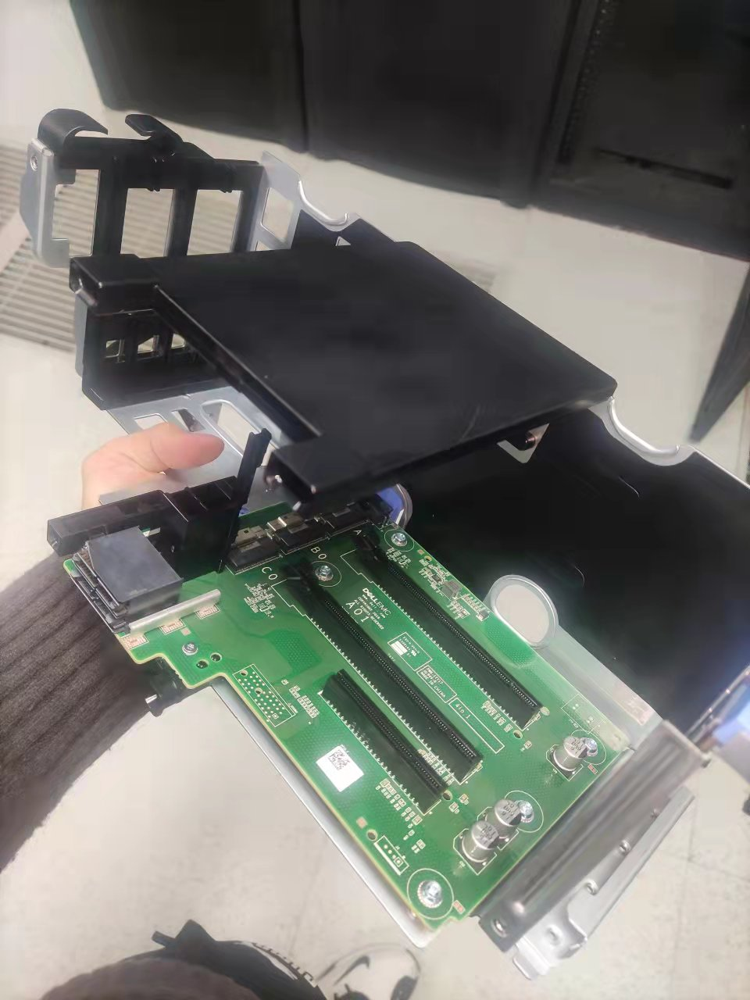
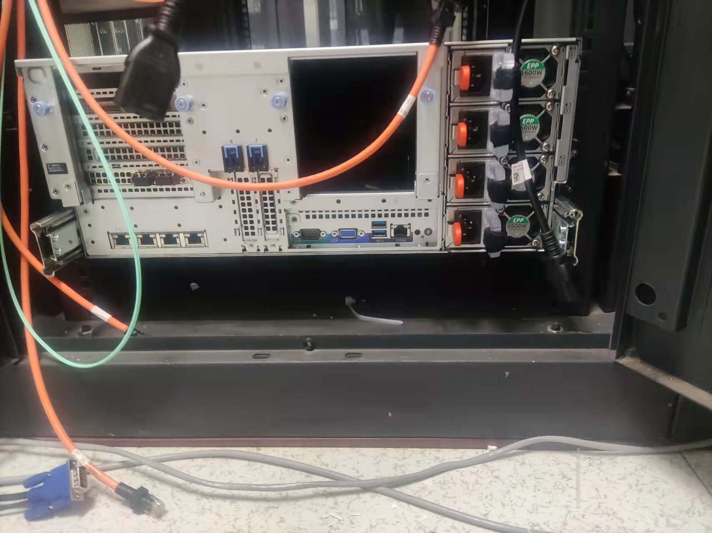
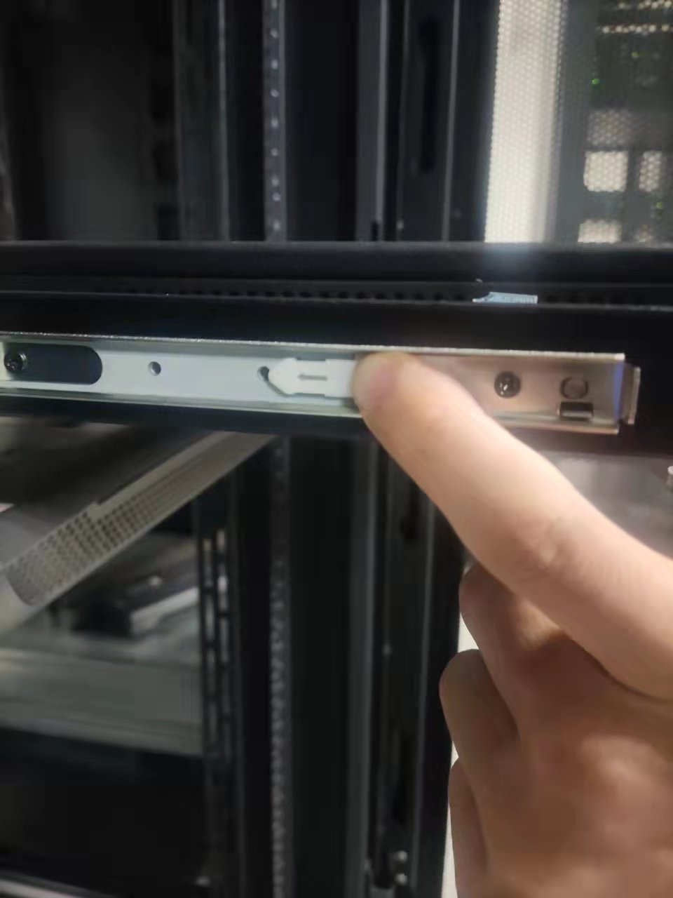

## KVM-over-IP Switches

> **Raritan provides a variety of KVM-over-IP Switches** that leverage today’s Ethernet and TCP/IP networks to provide anytime/anywhere remote access, control and management. Our Dominion KVM-over-IP switches provide at-the-rack access plus unlimited IP access and control via LAN, WAN and the Internet.
>
> 来源：Raritan

KVM-over-IP Switches可用于登陆机房服务器。

不支持两指滚屏操作。

| 具体OP         | 实质影响&其他                                  |
| -------------- | ---------------------------------------------- |
| 左键双击服务器 | 连接至服务器。有可能反应迟钝，双击间隔久一些。 |
| Fn + F12 双击  | 回到KVM-over-IP Switches主界面                 |

## DELL EMC

戴尔并购EMC（易安信）后，推出了戴尔EMC服务器。

电源键在服务器面板右上方，绿灯代表正常工作

| 具体OP       | 实质影响&其他 |
| ------------ | ------------- |
| Ctrl+Alt+Del | 重启服务器    |
|              |               |

### Power

此台服务器4电源，其中3块电源做冗余。实际上，一块电源就能够带动服务器运行。一般多块电池，都是做冗余，很少拿来做load balance。若想做load balance，在BIOS里可以更改。

### PCIe

PCIe集成内部

PCIe集成外部

服务器后部缺失PCIe集成

## 导轨

KVM-over-IP Switches控制台的导轨与服务器导轨类似，推进去时，需要把上图中的白色零件往里推，才能把导轨推进去。
