## 企业网络架构基础


|    术语    |               翻译                |
| :--------: | :-------------------------------: |
|    设备    |              Device               |
|    消息    |              Message              |
|   发送方   |              Sender               |
|   接收方   |             Receiver              |
|   信息源   |              Source               |
| 信息目的地 |            Destination            |
|   个域网   |    Personal Area Network，PAN     |
|   局域网   |      Local Area Network，LAN      |
|   园区网   |     CAN 	Campus Area Network      |
|   城域网   |  Metropolitan Area Network，MAN   |
|   广域网   |     Wide Area Network    WAN      |
| 无线广域网 | WWAN   Wireless Wide Area Network |


### 网络的性能指标

#### 带宽

bandwidth

以bps（bit per second，比特每秒）为单位

#### 延迟

delay

○ 描述数据从一个节点传送到另一个节点所经历的时间

○ 通常以ms为单位

## P2 传输介质简介

### 前言

​     通信网络除了包含通信设备本身之外，还包含连接这些设备的传输介质，如同轴电缆、双绞线和光纤等。不同的传输介质具有不同的特性，这些特性直接影响到通信的诸多方面，如线路编码方式、传输速度和传输距离等。

### 简单网络


### 介质(Media)

#### 同轴电缆


| 以太网标准 | 电缆类别   | 最长有效传输距离 |
| ---------- | ---------- | ---------------- |
| 10BASE5    | 粗同轴电缆 | 500米            |
| 10BASE2    | 细同轴电缆 | 185米            |

#### 双绞线


| 以太网标准 | 线缆类别          | 最长有效传输距离 |
| ---------- | ----------------- | ---------------- |
| 10BASE-T   | 两对3/4/5类双绞线 | 100米            |
| 100BASE-TX | 两对5类双绞线     | 100米            |
| 1000BASE-T | 四对5e类双绞线    | 100米            |

#### 光纤


| 以太网标准  | 线缆类别      | 最长有效传输距离 |
| ----------- | ------------- | ---------------- |
| 10BASE-F    | 单模/多模光纤 | 2000 米          |
| 100BASE-FX  | 单模/多模光纤 | 2000 米          |
| 1000BASE-LX | 单模/多模光纤 | 316 米           |
| 1000BASE-SX | 多模光纤      | 316 米           |

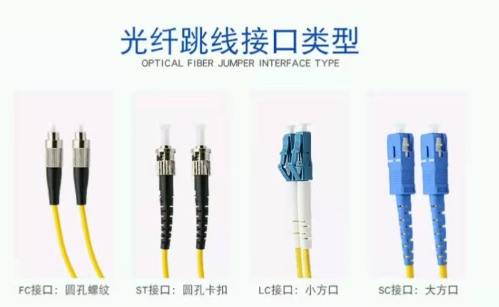

 "FC" is an acronym for "**ferrule(套圈) connector" or "fiber channel"**.

Square Connector 

#### 串口电缆


| 线缆类别 | 速率                    |
| -------- | ----------------------- |
| V.24     | 1.2Kbit/s ~ 64Kbit/s    |
| V.35     | 1.2Kbit/s ~ 2.048Mbit/s |

> 企业网络中部署千兆以太网时使用哪种传输介质？

能传输吉以太网的传输介质有网线、光纤。但是网线的质量参差不齐。差的网线，50米就达不到吉了，好一些的百米也达不到吉了。长距离传输，要么在网线中间加上交换机或者中继器、放大器等设备进行延长，要么使用光纤。

### 冲突域


共享式网络中可能会出现信号冲突现象。


> 何为冲突域？

共享的物理介质，进行双向传输所有物理节点的集合。若两主机在同一个冲突域内同时发送数据，则会发生冲突。

> CSMA/CD（Carrier Sense Multiple Access with Collision Detection，载波侦听多路访问/冲突检测）的作用？

解决冲突域的问题。

**1.先听后发**：先去侦听，再发送。

**2.边听边发**：发送时，边发边侦听。

**3.冲突停发**：一旦发生冲突，停止发送。继续侦听，直到没有冲突再。

4.随机延时重发。延时取决于算法。

### 双工模式

两种双工模式都支持双向数据传输。


## P3以太网帧结构(上-协议、分层、OSI)


上图表示了各种类型网络运用的不同协议。帧中继技术已被淘汰。


PDU: Protocol Data Unit, 协议数据单元


### 分层模型

#### OSI 7层


OSI（Open System Interconnection）把每一层数据称为PDU(Protocol Data Unit,协议数据单元)

物理层：在设备之间传输比特流，规定了电平、速度和电缆针脚。
数据链路层：将比特组合成字节，再将字节组合成帧，使用链路层地址（以太网使用MAC地址）来访问介质，并进行差错检测。
网络层：提供逻辑地址，供路由器确定路径。 
传输层：提供面向连接或非面向连接的数据传递以及进行重传前的差错检测。
会话层：负责建立、管理和终止表示层实体之间的通信会话。该层的通信由不同设备中的应用程序之间的服务请求和响应组成。
表示层：提供各种用于应用层数据的编码和转换功能，确保一个系统的应用层发送的数据能被另一个系统的应用层识别。
应用层：OSI参考模型中最靠近用户的一层，为应用程序提供网络服务。

#### TCP/IP 5层


TCP/IP模型不关注底层物理介质，主要关注终端之间的逻辑数据流转发。

TCP/IP模型的核心是网络层和传输层

网络层：解决网络之间的逻辑转发问题

传输层：保证源端到目的端之间的可靠传输。

最上层的应用层通过各种协议向终端用户提供业务应用。

### 数据封装


<center>网络接口层包含物理层、数据链路层</center>

应用数据需要经过TCP/IP每一层处理之后才能通过网络传输到目的端，每一层上都使用该层的协议数据单元PDU（Protocol Data Unit）彼此交换信息。不同层的PDU中包含有不同的信息，因此PDU在不同层被赋予了不同的名称。如上层数据在传输层添加TCP报头后得到的PDU被称为Segment（数据段）；数据段被传递给网络层，网络层添加IP报头得到的PDU被称为Packet（数据包）；数据包被传递到数据链路层，封装数据链路层报头得到的PDU被称为Frame（数据帧）；最后，帧被转换为比特，通过网络介质传输。这种协议栈逐层向下传递数据，并添加报头和报尾的过程称为封装。

### 终端之间的通信


数据链路层控制数据帧在物理链路上传输。

数据包在以太网物理介质上传播之前必须封装头部和尾部信息，封装后的数据包称为数据帧，数据帧中封装的信息决定了数据如何传输。以太网上传输的数据帧有两种格式，选择哪种格式由TCP/IP协议簇中的网络层决定。


> 广域网不能采用以太网的原因？

以太网方案最大特点是广播传输，主要目的是为了降低组网的成本。虽然复杂低效率CSMA/CD的介质访问控制方式能够解决以太网广播通信中出现的冲突问题，但广播带的开销限制了网络的传输效率、稳定性和安全性。其主要原因有2点：

1.以太网协议基于共享传输介质.以太网中每个节点都是利用``公共传输介质-总线``发送数据,CSMA/CD方法规定,节点在发送数据时首先侦听总线是否空闲(是否有电平跳变),只有等待总线空闲才能启动发送,以此来避免冲突.可以想象,当网络节点数大大增加后,这种对介质的争用将会极度激烈,等待时间会达到无法忍受的地步.从概念上说,以太网上某一时刻只能有一个节点处于发送状态,如果广域网都采用以太网,你能想象整个地球上某一时刻只能有一台计算机发送数据而其他机器全处于等待的情景吗?所以,不可以把广域网当作一条总线来处理.

2.CSMA/CD方法中规定的冲突检测方法是第二个致命因素.因为电流在电缆中的传播是需要一定时间的,仅采用载波侦听的办法是不能完全避免总线使用冲突的,你可以想象一下这种情况:在某一时刻,节点A侦听到总线空闲,因此它取得总线控制权向节点B发送数据,经过时间u的传播,就在载波信号即将到达B时,假设B此时正好也使用总线发送数据,则B发送的数据又要经过时间u才到达A,那时(2u后),A才能检测到总线上出现了叠加后的不合法信号,才判定冲突产生,随后进入随机延迟重发的状态.因此,为了避免上述情况的出现,以太网协议都会规定介质的最大长度D,由于电流传播速度V是恒定的,因此可以得出最大冲突检测时间2u=2D/V,把2u称作冲突窗口,即任何节点发送数据后2u时间里没有检测到冲突就可以确定自己已经取得了总线使用权.说到这里我们应该已经明白了以太网协议难以用于广域网的第二个原因了,以太网协议对介质的长度有强制限定.

广域网通信，其连接的节点情况要比局域网单纯，采用点到点的通信协议(PPP)会更高效，既便采用多点（多路访问）网络架构。


> 为何说TCP是可靠连接，UDP是不可靠连接，有何区别？

TCP传输数据时，首先需要建立可靠连接，即三次握手。连接建立成功后，才传输数据。

UDP不需要建立连接，直接传输数据。


## P4 以太网帧结构(TCP\IP分层、以太网帧结构)

### 帧格式


主要区别在于Ethernet II格式中包含一个Type字段，标识以太帧处理完成之后将被发送到哪个上层协议进行处理，IEEE 802.3格式中，同样的位置是长度字段。

不同的Type字段值可以用来区别这两种帧的类型，当Type字段值小于等于1500（或者十六进制的0x05DC）时，帧使用的是IEEE 802.3格式。当Type字段值大于等于1536 （或者十六进制的0x0600）时，帧使用的是Ethernet II格式。

以太网中大多数的数据帧使用的是Ethernet II格式。

以太帧中还包括源和目的MAC地址，分别代表发送者的MAC和接收者的MAC，此外还有帧校验序列字段，用于检验传输过程中帧的完整性。

Length/Type >= 1536 (0x0600)	                       Ethernet_II

Length/Type <= 1500 (0x05DC)                       IEEE802.3

#### Ethernet II


以太网数据帧的长度在64-1518字节之间。

Ethernet_II的帧中各字段说明如下：
DMAC（Destination MAC）是目的MAC地址。DMAC字段长度为6个字节，标识帧的接收者。
SMAC（Source MAC）是源MAC地址。SMAC字段长度为6个字节，标识帧的发送者。
类型字段（Type）用于标识数据字段中包含的高层协议，该字段长度为2个字节。类型字段取值为0x0800的帧代表IP协议帧；类型字段取值为0x0806的帧代表ARP协议帧。
数据字段（Data）是网络层数据，最小长度必须为46字节以保证帧长至少为64字节，数据字段的最大长度为1500字节。
循环冗余校验字段（FCS）提供了一种错误检测机制。该字段长度为4个字节。

#### IEEE 802.3


IEEE802.3帧格式类似于Ethernet_II帧，只是Ethernet_II帧的Type域被802.3帧的Length域取代，并且占用了Data字段的8个字节作为LLC和SNAP字段。
Length字段定义了Data字段包含的字节数。
逻辑链路控制LLC（Logical Link Control）由目的服务访问点DSAP（Destination Service Access Point）、源服务访问点SSAP（Source Service Access Point）和Control字段组成。
SNAP（Sub-network Access Protocol）由机构代码（Org Code）和类型（Type）字段组成。Org Code三个字节都为0。Type字段的含义与Ethernet_II帧中的Type字段相同。IEEE802.3帧根据DSAP和SSAP字段的取值又可分为以下几类：
       1）当DSAP和SSAP都取特定值0xff时，802.3帧就变成了Netware-ETHERNET帧，用来承载NetWare类型的数据。
       2）当DSAP和SSAP都取特定值0xaa时，802.3帧就变成了ETHERNET_SNAP帧。ETHERNET_SNAP帧可以用于传输多种协议。
       3）DSAP和SSAP其他的取值均为纯IEEE802.3帧。

### 数据帧传输


数据链路层基于MAC地址进行帧的传输。

以太网在二层链路上通过MAC地址来唯一标识网络设备，并且实现局域网上网络设备之间的通信。MAC地址也叫物理地址，大多数网卡厂商把MAC地址烧入了网卡的ROM中。发送端使用接收端的MAC地址作为目的地址。以太帧封装完成后会通过物理层转换成比特流在物理介质上传输。

#### 单播


单播，指从单一的源端发送到单一的目的端。每个主机接口由一个MAC地址唯一标识，MAC地址的OUI中，第一字节第8个比特表示地址类型。对于主机MAC地址，这个比特固定为0，表示目的MAC地址为此MAC地址的帧都是发送到某个唯一的目的端。在冲突域中，所有主机都能收到源主机发送的单播帧，但是其他主机发现目的地址与本地MAC地址不一致后会丢弃收到的帧，只有真正的目的主机才会接收并处理收到的帧。

#### 广播


广播，表示帧从单一的源发送到共享以太网上的所有主机。广播帧的目的MAC地址为十六进制的FF:FF:FF:FF:FF:FF，所有收到该广播帧的主机都要接收并处理这个帧。
广播方式会产生大量流量，导致带宽利用率降低，进而影响整个网络的性能。
当需要网络中的所有主机都能接收到相同的信息并进行处理的情况下，通常会使用广播方式。

#### 组播


组播，组播比广播更加高效。组播转发可以理解为选择性的广播，主机侦听特定组播地址，接收并处理目的MAC地址为该组播MAC地址的帧。
组播MAC地址和单播MAC地址是通过第一字节中的第8个比特区分的。组播MAC地址的第8个比特为1，而单播MAC地址的第8个比特为0。
当需要网络上的一组主机（而不是全部主机）接收相同信息，并且其他主机不受影响的情况下通常会使用组播方式。

### 数据帧的发送和接收


当主机接收到的数据帧所包含的目的MAC地址是自己时，会把以太网封装剥掉后送往上层协议。

帧从主机的物理接口发送出来后，通过传输介质传输到目的端。共享网络中，这个帧可能到达多个主机。主机检查帧头中的目的MAC地址，如果目的MAC地址不是本机MAC地址，也不是本机侦听的组播或广播MAC地址，则主机会丢弃收到的帧。
如果目的MAC地址是本机MAC地址，则接收该帧，检查帧校验序列（FCS）字段，并与本机计算的值对比来确定帧在传输过程中是否保持了完整性。如果帧的FCS值与本机计算的值不同，主机会认为帧已被破坏，并会丢弃该帧。如果该帧通过了FCS校验，则主机会根据帧头部中的Type字段来确定将帧发送给上层哪个协议处理。本例中，Type字段的值为0x0800，表明该帧需要发送到IP协议上处理。在发送给IP协议之前，帧的头部和尾部会被剥掉。

### MAC


OUI：Organizationally Unique Identifier唯一组的标识符


帧结构具体在数据包的体现如下图所示


上图中的一些解释：

**协议类型**：指的是所属协议的上层协议。例如在以太网-Ⅱ中的Protocol Type指的就是上层的三层协议，即IP。

**帧大小范围**：正常范围是64-1518，若帧大小不在正常范围，说明该数据包有问题，不健康。但是帧大小在正常范围内，数据包仍有可能有问题。

例如下图中的数据包帧大小<64，仔细查看发现校验和出现错误


像下图就属于Checksum正确的数据包


**MTU**：最大传输单元，Maximum Transmission Unit。默认1500字节，每次发送的数据的最大值。通过以太网的帧结构图可以看出，数据的范围是46-1500，那么最大值1500即是MTU。


上图红框内的数字，前一位代表在此字段之前已有了多少字节，后一位代表这个字段有多少字节。


**FCS**：Frame Check Sequence（帧校验序列），俗称帧尾，即计算机网络数据链路层的协议数据单元（帧）的尾部字段，是一段4个字节的循环冗余校验码。通过一定的计算公式对数据包进行计算。源节点发送数据帧时，由帧的帧头和数据部分计算得出FCS，目的节点接收到后，用同样的方式再计算一遍FCS，如果与接收到的FCS不同，则认为帧在传输过程中发生了错误，从而选择丢弃这个帧。FCS提供了一种错误检测机制，用来验证帧在传输过程中的完整性。


通过科来数据包生成器来修改数据包参数，任何一个微小的改动都会导致FCS的改变。

> 网络设备如何确定以太网数据帧的上层协议？

以太网帧中包含一个Type字段，表示帧中的数据应该发送到上层哪个协议处理。比如，IP协议对应的Type值为0x0800，ARP协议对应的Type值为0x0806。

> 终端设备接收到数据帧时，会如何处理？

主机检查帧头中的目的MAC地址，如果目的MAC地址不是本机MAC地址，也不是本机侦听的组播或广播MAC地址，则主机会丢弃收到的帧。如果目的MAC地址是本机MAC地址，则接收该帧，检查帧校验序列（FCS）字段，并与本机计算的值对比来确定帧在传输过程中是否保持了完整性。如果检查通过，就会剥离帧头和帧尾，然后根据帧头中的Type字段来决定把数据发送到哪个上层协议进行后续处理。

## P5 IP编址


上图详情：

Version：表示用的是IPv4还是IPv6

Header Length：表示此IP报文头部长度是多少，范围是20-60字节。若为20字节代表此报文头部不附带IP Option。

DS Field：差分服务域。差分服务域是当我们在IPv4里部署QoS时用到的，目的是为流量提供差分服务，保证QoS服务要求。

Total length:若此报文是IPv4，则表示IPv4报文头部长度+IPv4报文数据长度(有效载荷长度)，即IPv4报文总长度。若此报文是IPv6，则为一个固定值，因为IPv6报文的头部长度和数据长度都是固定的。

Identification：标识位。占16位。IP软件在存储器中维持一个计数器，每产生一个数据报，计数器就加1，并将此值赋给标识字段。但这个“标识”不是序号，因为IP是无连接服务，数据报不存在按序接收的问题。当数据报由于长度超过网络的MTU(最大传输单元,Maximum Transmission Unit)而必须分片时，这个标识字段的值就被复制到所有的数据报片的标识字段中。相同的标识字段的值使分片后的各数据报片最后能正确地重装成为原来的数据报。

Flags：标志位，占3位，但目前只有2位有意义。标志字段中的最低位为MF（More Fragment）。MF=1即表示后面“还有分片”的数据报；

MF=0表示这已是若干数据报片中的最后一个。

标志字段中间的一位记为DF（Don't Fragment），意思是“不能分片”。只有当DF=0时才允许分片。

Fragment Offset：片偏移，占13位。片偏移用于在较长的分组在分片后，某片在原分组中的相对位置。也就是说，相对于用户数据字段的起点，该片从何处开始。片偏移以8个字节为偏移单位。也就是说，每个分片的长度一定是8字节（64位）的整数倍。

TTL:防止数据在传输过程中出现环路。数据传输途中(不包含起止)每经过一个三层设备，值减一。

Protocol：指的是上层承载(可能是传输层，可能是应用层)的协议。

6表示上层承载的是TCP；

17表示上层承载的是UDP。


私有IP地址是一段保留的IP地址。只使用在局域网中，无法在Internet上使用。

私有地址范围：

10.0.0.0-10.255.255.255

172.16.0.0-172.31.255.255

192.168.0.0-192.168.255.255


特殊地址：

127.0.0.0-127.255.255.255	表示环回地址(本机)

0.0.0.0	表示未指定地址

255.255.255.255	表示所有网络广播


## P7 ICMP

> PING使用的是哪两类ICMP消息？

echo request 和echo reply。

> 当网络设备收到TTL值为0的IP报文时，会如何操作？

丢弃。


## P9 ARP

arp的request在广播域里是无法拒收的。既然是广播那么目标MAC就是全F。arp不能穿越三层接口。
ARP是TCP/IP协议栈里最不安全的protocol。ARP攻击也是局域网攻击里使用最多的。
### arp proxy

实现步骤：

1.在router的入接口输入，`arp-proxy en`

2.保证2台PC处于同一网段。arp request 必须是同一网段才能发送。

现在已经不用ARP代理技术进行第一跳冗余，堆叠、VRP等新技术可以替代。


无故（Gratuitous ARP，GARP）ARP也称为无为ARP、免费ARP。主机、网络设备接口当启用IP地址时，会使用自己的IP地址作为目标地址发送ARP请求，来探测IP地址是否冲突。

ARP防火墙原理：手动记住网关MAC，免受ARP欺骗。


## P10 传输层协议


五元组：源IP，目的IP，源端口号，目的端口号，协议

| 端口号范围  | 端口类别      | TCP                                                                                                                   | UDP                  | TCP&UDP通用          |
| ----------- | ------------- | --------------------------------------------------------------------------------------------------------------------- | -------------------- | -------------------- |
| 0-1023      | 公认端口      | 21 FTP<br />23 Telnet<br />25 SMTP<br />80 HTTP<br />110 POP3<br />194 Internet中继聊天(IRC)<br />443 安全HTTP(HTTPS) | 69 TFTP<br />520 RIP | 53 NDS<br />161 SNMP |
| 1024-49151  | 注册端口      | 1863 MSN Messenger<br />8008 HTTP备用<br />8080 HTTP备用                                                              |                      |                      |
| 49152-65535 | 私有&动态端口 |                                                                                                                       |                      |                      |


URG、ACK等标志位默认值都是0.


①主机发送TCP报文。

此报文：

序列号(也叫顺序号，seq,完整表述应为sequence number)为a(具体数值随机)；

SYN(synchronous，建立联机)标志置位(置位=值为1，默认值为0)。

②服务器发送TCP报文。

此报文：

序列号为b(具体数值随机)；

ack(确认号.完整表述为acknowledge number)值为a+1，表示服务器收到了刚刚主机发送的序列号为a的报文，接下来想让对方发送给序列号为a+1的报文；

SYN(synchronous，建立联机)标志置位(置位=值为1)；

ACK(acknowledgement 确认)标志置位，值得一提，只有ACK为1，确认号才有效。

③主机收到服务器发送的报文后，检查ack number是否正确，即第一次发送的seq number+1，以及ACK位是否为1。若正确，主机会再发送TCP报文。

此报文：

序列号为a+1;

ack number=(主机B的seq+1)；

ACK=1。

> 为何一定是3次握手，2次握手和4次握手为何不行？

3次握手的目的是：为了防止已经失效的连接请求报文段突然又传到服务端，因而产生错误。

那么若2次握手，可能会遇到下面问题：

①当主机A出去的第一个连接请求报文并没有丢失，而是因为某些未知的原因在某个网络节点上发生滞留，导致延迟到连接释放以后的某个时间才到达另一端(server)B。为了建立连接，客户端会重发SYN。本来这是一个早已失效的报文段，但是B收到此失效的报文之后，会误认为是A发出的又一个新的连接请求，于是B端就又向A又发出确认报文，表示同意建立连接，且B端立即开始等待接受数据。那么B端就白白等待，浪费了资源。

②当主机A发送请求连接报文。随后B回复确认报文，但此报文丢失。此时，B已经在等待接受数据，A却没有收到确认报文。

上面2个场景说明，3次握手的最后一次，即A确认报文这个环节是必不可少的。

4次握手没有必要，浪费资源。


## P11 传输层协议

> TCP头部中的确认标识有什么作用？

确认收到的数据内容。

> TCP头部中有哪些标识位参与TCP三次握手？

SYN，ack。

> TCP头部中有哪些标识位参与TCP四次挥手？

fin，ack。


## P12 数据转发过程


> 数据在进行二层三层封装之前，主机需要了解哪些信息？

| 层数 | 信息   |
| ---- | ------ |
| 二层 | MAC    |
| 三层 | IP地址 |

> 当数据帧发送到非目的主机时，非目的主机将会如何处理？

∵MAC不一致，丢弃。

> 传输层如何能够准确地将数据交给特定应用？

不同的应用对应不同的端口，故通过端口能达到目的。

> 当两台主机同时访问服务器的HTTP服务，该服务器如何区分数据属于哪个会话？

一般我们通过这5个参数区分会话，源端口，目的端口，源IP，目的IP ，协议。此问题可通过前4者进行区分。


## P13 VRP基础

### 使用串口连接网络设备


NVRAM中的NV代表“非易失性”。

4个文件属性：drwx

d：directory 表示文件夹

r: read 读

w: write 写

x:表示执行文件


> 如果路由器收到了网络中主机发送的广播报文，会如何操作？

如果收到的是一个ARP报文，若ARP报文正好在请求路由器的接口mac地址,那么路由器会响应。否则，路由器不进行转发报文。

> 华为数通设备目前使用的VRP版本是多少？

大多数产品使用vrp5,少数高端产品使用vrp8.


## P14 命令行基础


在eNSP里，若没有设置登陆密码，则网络设备会自动登录。


> 华为网络设备同时允许支持多少个用户同时使用Console？

1个

> 在使用命令interface loopback 0之后，loopback 0的接口状态是什么？

状态是UP。


## P15 文件系统基础

> 设备中的文件属性有drw，其中各个字母代表什么含义？

directory -read-write

> 若设备中有多个配置文件，如何指定下次启动时使用的配置文件？

设置startup configuration。

## P31 FTP原理与配置

通过FTP可以备份网络设备的VRP、配置文件。
在使用FTP Protocol进行路由器软件升级时，传输模式应选用二进制模式。

## SW
通过实验证实，SW可接收处理带Tag的帧。

### P17交换网络基础

> 当一台主机从交换机的一个端口移动到另外一个端口时，交换机的MAC地址表会发生什么变化？

即使在未移动之前，交换机CAM表里已经有端口和MAC信息，当拔掉网线进行移动时，CAM表立刻老化。后期交换机再接收到帧时，最终经过交换机的学习，交换机将学习CAM表。

### VLAN间路由（三层交换）

MLS（MultiLayer Switch）是执行三层信息的硬件交换的交换机,即有带ip的vlanif 接口的SW，可实现VLAN间路由。

### P18 STP

BID=Brideg ID=桥ID

STP优先级越小越优先. STP优先级的设置不是随心所欲的，是有固定值的，即最小是0，第二小是4096，接着是4096的倍数，即步长为4096，最大是32768。0，4096.......,32768。

当两个交换机相连的一刹那，2个SW都认为自己是根桥，都互相发送BPUD。

开销值=路径代价


Blocking也叫做Discarding

Learning状态下交换机学习MAC地址。

1 端口初始化或使能;
2 端口被选为根端口或指定端口。
3 端口不再是根端口或指定端口。
4  forward delay计时器超时。耗时15s。也就是说，从Listening状态→Forwarding状态，耗时30s，RSTP可以有效地改善这点。
5  端口禁用或链路失效。


### P19 BPDU

为了计算生成树，SW之间需要交换相关信息和参数，这些信息和参数被封装在BPDU(Bridge Protocol Data Unit,桥协议数据单元)中。

非根桥的交换机收到根桥发送的BPDU才会触发。


BPDU有2种类型


配置BPDU：

配置BPDU包含桥ID、路径开销和端口ID等参数。STP通过在交换机之间传递配置BPDU来选举根SW，以及确定每个SW端口的角色和状态。在初始化过程中，每个桥都主动发送配置BPDU。在网络拓扑稳定以后，只有根桥主动发送配置BPDU，其他SW在收到上有传来的配置BPDU后，才会发送自己的配置BPDU。配置BPDU包含了足够的信息来保证设备完成生成树计算。

配置BPDU包含的重要信息如下：

- 根桥ID：每个STP网络种有且仅有一个根。
- 指定桥ID：指定桥ID和根桥ID的组成部分一样。


- 根路径开销：到根桥的最短路径开销。
- 指定端口ID：


- Message Age：配置BPDU在网络中传播的生存期。Message Age没。BPDU从根桥发送出来，Message Age=0，之后每经过一个SW就+1。默认当Message Age=20，达到上限，非根桥会丢弃该BPDU。Message Age的上限是可以修改的。
- Max Age：配置BPDU在设备中能够保存的最大生存期。上一次非根桥收到根桥发送的BPDU等待耗时20s，那么Max Age=20s。若下一次耗时20s后，非根桥还未收到根桥发送的BPDU，那么非根桥判断根桥出问题了，重新选举根桥。
- Hello Time：配置BPDU发送的周期。2s发送一次。
- Forward Delay：端口状态迁移的延时。默认15s。


TCN BPDU：

TCN BPDU指的是下游SW感知到拓扑发生变化时向上游发送的拓扑变化通知。


SW的默认STP Mode不是802.1d，而是MSTP。

```
[Huawei]stp mode ?
  mstp  Multiple Spanning Tree Protocol (MSTP) mode
  rstp  Rapid Spanning Tree Protocol (RSTP) mode
  stp   Spanning Tree Protocol (STP) mode 	#802.1d
[Huawei]stp mode stp	#切换STP模式为STP802.1d。
```


```
[Huawei]dis stp
-------[CIST Global Info][Mode MSTP]-------	#此行信息可查看STP模式
CIST Bridge         :32768.4c1f-cc7a-2c11	#根桥ID
Config Times        :Hello 2s MaxAge 20s FwDly 15s MaxHop 20
Active Times        :Hello 2s MaxAge 20s FwDly 15s MaxHop 20
CIST Root/ERPC      :32768.4c1f-cc03-4256 / 20000	#根路径开销
CIST RegRoot/IRPC   :32768.4c1f-cc7a-2c11 / 0
CIST RootPortId     :128.1
BPDU-Protection     :Disabled
TC or TCN received  :2
TC count per hello  :0
STP Converge Mode   :Normal 
Time since last TC  :0 days 0h:3m:51s
Number of TC        :2
Last TC occurred    :GigabitEthernet0/0/1

```


```
[Huawei]dis stp br
 MSTID  Port                        Role  STP State     Protection
   0    GigabitEthernet0/0/1        DESI  DISCARDING      NONE
   0    GigabitEthernet0/0/2        ROOT  FORWARDING      NONE
```


## 路由


 选路3原则：

1.最长匹配

2.protocol（Priority）

3.Cost

在win里，跃点数=度量值=Cost


### 静态
当配置了默认路由，但`dis ip rou`路由表里不显示时，应该检查是否没有配置交换机可达的ip。

#### Floating Route

```
ip routing-table (Destination) (mask) (Next Hop) preference (优先级) 
#当有同样的(Destination) (mask) (Next Hop)的路由存在时，再配置此命令实现 Floating Route。
```


### 动态Route

#### rip

当路由器超出30s的Update Time还未收到路由更新信息，那么收端R会进入180s的Age time。

若过完Age Time后，还未收到路由更新信息，进入120s的Garbage-Collect Time。

若仍未收到路由更新信息，那么收端路由器会认为发送端路由器不可达，收端路由器在路由表中删除之前学习到的相应的路由条目。若之后发送端再发送信息给收端路由器，收端路由器都不会接收了。


进入rip视图

```
timers rip （Update Time） （Age Time）（Garbage-Collect Time）	#修改时间参数.通常情况下，无需改变缺省值，该命令须谨慎使用。
```


系统试图

```
dis rip 1 database	#显示rip 1的数据库
dis rip 1 route	#显示rip 1 的路由
dis rip 1 neighbor	#显示rip邻居信息
```


rip认证是在端口视图下做的。


##### 防环机制

1.16Hop不可达

2.Split-horizon

3.poison-reverse

4.触发更新


> 当split-horizon & poison-reverse 同时配置，为何只让poison-reverse生效？

split-horizon使得本来要接受路由更新信息的路由器收不到信息，于是进入Age Time & Garbage-Collect Time。而poison-reverse是发一个16hop的路由更新信息，发过去马上


##### 版本互通


已知R1、R2上的rip version都是1，R3 rip version 为2.

```python
[R1]dis rip 1 int g0/0/0 verbose
 GigabitEthernet0/0/0(192.168.12.1)
  State           : UP          MTU    : 500
  Metricin        : 0       
  Metricout       : 1       
  Input           : Enabled     Output : Enabled     
  Protocol        : RIPv1 Compatible (Non-Standard)
  Send version    : RIPv1 Packets											#只发v1包
  Receive version : RIPv1 Packets, RIPv2 Multicast and Broadcast Packets	#收v1、v2组播、广播包
  Poison-reverse                : Disabled 
  Split-Horizon                 : Enabled
  Authentication type           : None 
  Replay Protection             : Disabled 
  
 #查看R1 rip路由条目
[R1]dis ip routing-table  protocol rip
Route Flags: R - relay, D - download to fib
------------------------------------------------------------------------------
Public routing table : RIP
         Destinations : 2        Routes : 2        

RIP routing table status : <Active>
         Destinations : 2        Routes : 2

Destination/Mask    Proto   Pre  Cost      Flags NextHop         Interface

        3.0.0.0/8   RIP     100  2           D   192.168.12.2    GigabitEthernet
0/0/0
   192.168.23.0/24  RIP     100  1           D   192.168.12.2    GigabitEthernet
0/0/0

RIP routing table status : <Inactive>
         Destinations : 0        Routes : 0
```

从R1的反馈结果可以看出，有RIP的路由信息，∵V1可以收v2组播包。

接下来看看R3的情况。

```
[R3]dis rip 1 int g0/0/1 ver
 GigabitEthernet0/0/1(192.168.23.3)
  State           : UP          MTU    : 500
  Metricin        : 0       
  Metricout       : 1       
  Input           : Enabled     Output : Enabled     
  Protocol        : RIPv2 Multicast
  Send version    : RIPv2 Multicast Packets 				#发v2组播包。
  Receive version : RIPv2 Multicast and Broadcast Packets	#收v2组播、广播包
  Poison-reverse                : Enabled 
  Split-Horizon                 : Enabled
  Authentication type           : None 
  Replay Protection             : Disabled 
  
   #查看R3 rip路由条目
[R3]dis ip routing-table protocol rip
[R3]									#证明R3rip route为空。∵R3只能收v2组播、广播包，但R1发的是v1包。
```

通过以上信息，可知不加干预的情况下，v1 & v2 不可通信。从R3 ping R1，虽然R1能收到request，但是R3却收不到response.  What shoud I do?

若非要通信，则需要将R2的GigabitEthernet0/0/1的rip version修改成 v2组播。

```
[R2-GigabitEthernet0/0/1]rip ver 2 multicast
```

这样全局就可以互相通信了。


##### VLSM & CIDR


```python
[R3-GigabitEthernet0/0/1]rip summary-address 3.3.0.0 255.255.252.0	#Mask要求要写全。
```

已实现CIDR

```python
[R2]dis ip routing-table protocol rip
Route Flags: R - relay, D - download to fib
------------------------------------------------------------------------------
Public routing table : RIP
         Destinations : 1        Routes : 1        

RIP routing table status : <Active>
         Destinations : 1        Routes : 1

Destination/Mask    Proto   Pre  Cost      Flags NextHop         Interface

        3.3.0.0/22  RIP     100  1           D   192.168.23.3    GigabitEthernet
0/0/1

RIP routing table status : <Inactive>
         Destinations : 0        Routes : 0
```


> 若在R3再开个lo4，ip为3.3.15.3/24，R2能ping R3吗？

添加完lo4后，尝试从R2 ping R3，发现虽然第一次丢包了，但是之后能ping通。再次查看R2 rip 路由表。 

```python
[R2]dis ip routing-table protocol rip
Route Flags: R - relay, D - download to fib
------------------------------------------------------------------------------
Public routing table : RIP
         Destinations : 2        Routes : 2        

RIP routing table status : <Active>
         Destinations : 2        Routes : 2

Destination/Mask    Proto   Pre  Cost      Flags NextHop         Interface

        3.3.0.0/22  RIP     100  1           D   192.168.23.3    GigabitEthernet
0/0/1
       3.3.15.0/24  RIP     100  1           D   192.168.23.3    GigabitEthernet
0/0/1

RIP routing table status : <Inactive>
         Destinations : 0        Routes : 0
```

通过上面的Routing-table可以看到，R2也学到了lo4的 route。∵R3早在之前就已经`network 3.0.0.0`了。


##### 选路控制


上下2条路，若修改了任意一条路的MetricIn，则R1 ping R4 的ICMP Request & Reply都走另一条路。


#### ospf

系统视图下

```
dis ospf lsdb   #显示ospf Link State DataBase
dis ip routing-table protocol ospf #显示ospf路由表
```


$$
2^{32}-1=	4,294,967,295
$$
area的取值范围是

```
  INTEGER<0-4294967295>  OSPF area ID (Integer)
  IP_ADDR<X.X.X.X>       OSPF area ID (IP address)
```

OSPF划分区域的好处：


LSA一共三类。一类、二类的LSA被限制在单个区域，而三类的LSA没有限制。


##### 5种报文&7种状态
LSA属于LSU。

DBD packet contains the following fields :

1. Interface MTUs
2. Initial bit - To indicate of this is the first in series of DBD packets
3. More bit - Last packet will have this value as 0
4. Master/Slave
5. DD Sequence Number -Used to sequence the collection of DBD packets. The initial value should be unique. The sequence number then increments by 1 until the complete database description has been sent.(4-bytes)
6. LSA Header
7. Options

邻居的关系不如邻接紧密。邻居只是打招呼而已。邻接关系，双方会发送DD报文，共享LSDB内容。这也是为啥说邻居关系包含邻接。

每个路由器一开始都会认为自己是主路由器，所以会出现多个DB包Master值都是1，关键就在RID。RID越大，就越有资格成为主Router。

The M in M-bit stands for More, and M-bit=1 indicates that there is more to the DD packet. M-bit = 1 indicates that there is more to the DD packet, and M-bit = 0 at the end of a series of DD packet exchanges.

```
The Database Exchange Process is over when a router has received and sent Database Description Packets with the M-bit off.
https://community.cisco.com/t5/routing/ospf-neighbor-adjacency/td-p/2941856
```

下面展示的是2台router协商主从路由器过程中往来的DBD包。我将配合拟人化的例子来说明：


<center>1st DBD</center>

RID为1.1.1.1的路由器率先发包，要求对方路由器，“我是主人，请你和我这样说，DD Sequence：2615”


<center>2nd DBD</center>

RID为2.2.2.2的路由器不甘示弱，说“我的RID比你大，我才是主人，你应该是仆人，你应该听我的。请你和我这样说，DD Sequence：471”


<center>3rd DBD</center>

RID为1.1.1.1的路由器说“你确实是主人，我听你的。DD Sequence：471。DB Description里附带了我的LSDB摘要。”


<center>4th DBD</center>

RID为2.2.2.2说“请你和我这样说，DD Sequence：472。DB Description里附带了我的LSDB摘要。”


<center>5th DBD</center>

RID为1.1.1.1的路由器说“DD Sequence：472。够了，主从关系已经确立。别再说DD Sequence了。”

##### Config

```
[Huawei-ospf-1]bandwidth-reference 100    #调整带宽参考值，默认为100Mbps.需要在整个OSPF网络中统一进行调整
```

#### RIP VS ospf

##### RIP的缺点

###### 16Hop不可达

###### 只认Cost

Cost越小，越优先。但比如说，Cost小的百兆路线，显然是不如Cost高的千兆路线。RIP的不灵活性也就暴露出来。RIP只考虑距离矢量，而不考虑链路状态。


OSPF协议的优先级(优先数是10，越小级别越高)比rip高。

RIPv2才支持mask，v1不支持。而OSPF支持mask。

## HDLC&PPP

### 前言
    广域网中经常会使用串行链路来提供远距离的数据传输，高级数据链路控制HDLC（High-Level Data Link Control）和点对点协议PPP（ Point to Point Protocol）是两种典型的串口封装协议。
### 串行链路的数据传输方式
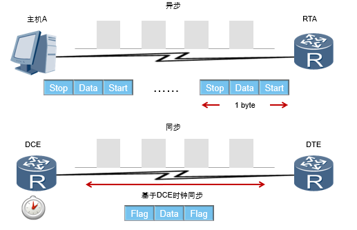
串行链路普遍用于广域网中。串行链路中定义了两种数据传输方式：异步和同步。 
**异步传输**是以字节为单位来传输数据，并且需要采用额外的起始位和停止位来标记每个字节的开始和结束。起始位为二进制值0，停止位为二进制值1。在这种传输方式下，开始和停止位占据发送数据的相当大的比例，每个字节的发送都需要额外的开销。
**同步传输**是以帧为单位来传输数据，在通信时需要使用时钟来同步本端和对端的设备通信。DCE即数据通信设备，它提供了一个用于同步DCE设备和DTE设备之间数据传输的时钟信号。DTE即数据终端设备，它通常使用DCE产生的时钟信号。
### HDLC
#### HDLC协议应用
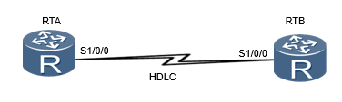
High-level Data Link Control，高级数据链路控制，简称HDLC，是一种面向比特的链路层协议。
ISO制定的HDLC是一种面向比特的通信规则。HDLC传送的信息单位为帧。作为面向比特的同步数据控制协议的典型，HDLC具有如下特点：
协议不依赖于任何一种字符编码集；
数据报文可透明传输，用于透明传输的“0比特插入法”易于硬件实现；
全双工通信，不必等待确认可连续发送数据，有较高的数据链路传输效率；
所有帧均采用CRC校验，并对信息帧进行编号，可防止漏收或重收，传输可靠性高；
传输控制功能与处理功能分离，具有较大的灵活性和较完善的控制功能。
#### HDLC帧结构
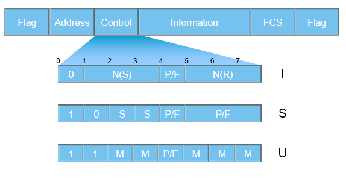
HDLC有三种类型的帧：信息帧、监控帧、无编号帧。
完整的HDLC帧由标志字段（F）、地址字段（A）、控制字段（C）、信息字段（I）、帧校验序列字段（FCS）等组成。
标志字段为01111110，用以标志帧的开始与结束，也可以作为帧与帧之间的填充字符。
地址字段携带的是地址信息。
控制字段用于构成各种命令及响应，以便对链路进行监视与控制。发送方利用控制字段来通知接收方来执行约定的操作；相反，接收方用该字段作为对命令的响应，报告已经完成的操作或状态的变化。
信息字段可以包含任意长度的二进制数，其上限由FCS字段或通讯节点的缓存容量来决定，目前用得较多的是1000-2000比特，而下限可以是0，即无信息字段。监控帧中不能有信息字段。
帧检验序列字段可以使用16位CRC对两个标志字段之间的内容进行校验。

HDLC有三种类型的帧：
1. 信息帧（I帧）用于传送有效信息或数据，通常简称为I帧。
2. 监控帧（S帧）用于差错控制和流量控制，通常称为S帧。S帧的标志是控制字段的前两个比特位为“10”。S帧不带信息字段，只有6个字节即48个比特。
3. 无编号帧（U帧）简称U帧。U帧用于提供对链路的建立、拆除以及多种控制功能。
#### HDLC基本配置
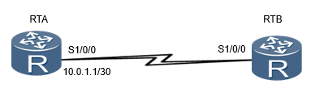 
``` 
[RTA]interface Serial 1/0/0 
[RTA-Serial1/0/0]link-protocol hdlc 
Warning: The encapsulation protocol of the link will be changed. Continue? [Y/N]:y 
[RTA-Serial1/0/0]ip address 10.0.1.1 30
```
用户只需要在串行接口视图下运行link-protocol hdlc命令就可以使能接口的HDLC协议。华为设备上的串行接口默认运行PPP协议。用户必须在串行链路两端的端口上配置相同的链路协议，双方才能通信。
#### HDLC接口地址借用
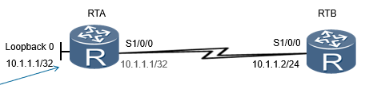  
```
[RTA]interface Serial 1/0/0 
[RTA-Serial1/0/0]link-protocol hdlc 
Warning: The encapsulation protocol of the link will be changed. Continue? [Y/N]:y 
[RTA-Serial1/0/0]ip address unnumbered interface loopBack 0
[RTA]ip route-static 10.1.1.0 24 Serial 1/0/0 
```
串行接口可以借用Loopback接口的IP地址和对端建立连接。
一个接口如果没有IP地址就无法生成路由，也就无法转发报文。IP地址借用允许一个没有IP地址的接口从其它接口借用IP地址。这样可以避免一个接口独占IP地址，节省IP地址资源。一般建议借用loopback接口的IP地址，因为这类接口总是处于活跃（active）状态，因而能提供稳定可用的IP地址。
本例中，在RTA的S1/0/0接口配置完接口地址借用之后，还需要在RTA上配置静态路由，以使RTA能够转发数据到10.1.1.0/24网络。
例如ip route-static 10.1.1.2 32 s1/0/0
#### 配置验证
```
[RTA]display ip interface brief 
*down: administratively down ^down: standby (l): loopback
(s): spoofing
……
Interface                IP Address/Mask    Physical   Protocol  
LoopBack0                10.1.1.1/32          up         up(s)     
Serial1/0/0              10.1.1.1/32          up         up      
Serial1/0/1              unassigned           up         down      
```
执行display ip interface brief命令可以查看路由器接口简要信息。如果有IP地址被借用，该IP地址会显示在多个接口上，说明借用loopback接口的IP地址成功。

### PPP

#### PPP协议应用

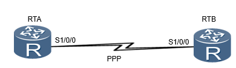  
PPP(P2P协议)是一种点到点链路层协议，主要用于在全双工的同异步链路上进行点到点的数据传输。PPP协议有如下优点：

1. PPP既支持同步传输又支持异步传输，而X.25、FR（Frame Relay）等数据链路层协议仅支持同步传输，SLIP仅支持异步传输。
2. PPP协议具有很好的扩展性，例如，当需要在以太网链路上承载PPP协议时，PPP可以扩展为PPPoE。
3. PPP提供了LCP（Link Control Protocol）协议，用于各种链路层参数的协商。
4. PPP提供了各种NCP（Network Control Protocol）协议（如IPCP、IPXCP)，用于各网络层参数的协商，更好地支持了网络层协议。
5. PPP提供了认证协议：CHAP（Challenge-Handshake Authentication Protocol）、PAP（Password Authentication Protocol)，更好的保证了网络的安全性。
6. 无重传机制，网络开销小，速度快。

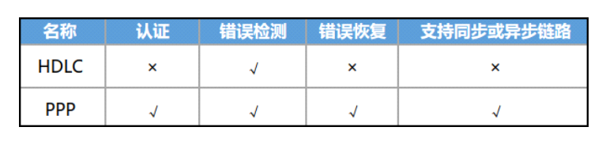

#### PPP组件

| 名称                                     | 作用                                         |
| ---------------------------------------- | -------------------------------------------- |
| 网络层控制协议  Network Control Protocol | 用于对不同的网络层协议进行连接建立和参数协商 |
| 链路控制协议  Link Control Protocol      | 用来建立、拆除和监控PPP数据链路              |

LCP在下，NCP在上，不注意很容易搞错。记忆方法：类比OSI，网络层也在链路控制层上面。

PPP包含两个组件：链路控制协议LCP和网络层控制协议NCP。

为了能适应多种多样的链路类型，PPP定义了链路控制协议LCP。LCP可以自动检测链路环境，如是否存在环路；协商链路参数，如最大数据包长度，使用何种认证协议等等。与其他数据链路层协议相比，PPP协议的一个重要特点是可以提供认证功能，链路两端可以协商使用何种认证协议来实施认证过程，只有认证成功之后才会建立连接。

PPP定义了一组网络层控制协议NCP，每一个NCP对应了一种网络层协议，用于协商网络层地址等参数，例如IPCP用于协商控制IP协议，IPXCP用于协商控制IPX协议等。

因为使用了网络层的IP，所以NCP在设备中显示的是IPCP。


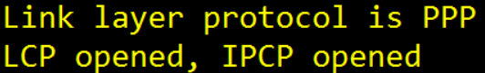

<center>上图信息说明接口未配IP。</center>

#### PPP链路建立过程

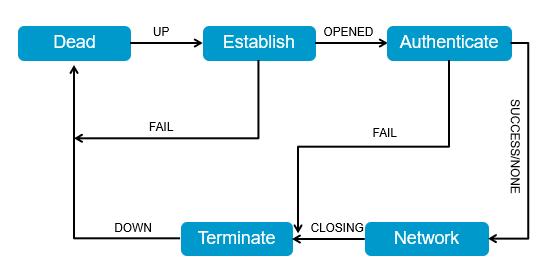

对于PPP链路建立过程的描述如下：

1.Dead阶段也称为物理层不可用阶段。当通信双方的两端检测到物理线路激活时，就会从Dead阶段迁移至Establish阶段，即链路建立阶段。 

2.在Establish阶段，PPP链路进行LCP参数协商。协商内容包括最大接收单元MRU、认证方式、魔术字（Magic Number）等选项。LCP参数协商成功后会进入Opened状态，表示底层链路已经建立。

3.多数情况下,链路两端的设备是需要经过认证阶段（Authenticate）后才能够进入到网络层协议阶段。PPP链路在缺省情况下是不要求进行认证的。如果要求认证，则在链路建立阶段必须指定认证协议。认证方式是在链路建立阶段双方进行协商的。如果在这个阶段再次收到了Configure-Request报文，则又会返回到链路建立阶段。

4.在Network阶段，PPP链路进行NCP协商。通过NCP协商来选择和配置一个网络层协议并进行网络层参数协商。只有相应的网络层协议协商成功后，该网络层协议才可以通过这条PPP链路发送报文。如果在这个阶段收到了Configure-Request报文，也会返回到链路建立阶段。

5.NCP协商成功后，PPP链路将保持通信状态。PPP运行过程中，可以随时中断连接，例如物理链路断开、认证失败、超时定时器时间、管理员通过配置关闭连接等动作都可能导致链路进入Terminate阶段。

6.在Terminate阶段，如果所有的资源都被释放，通信双方将回到Dead阶段，直到通信双方重新建立PPP连接。

#### PPP帧格式

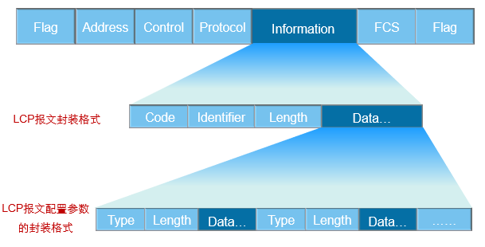

PPP采用了与HDLC协议类似的帧格式：

1.Flag域标识一个物理帧的起始和结束，该字节为二进制序列01111110（0X7E）。

2.PPP帧的地址域跟HDLC帧的地址域有差异，PPP帧的地址域字节固定为11111111 （0XFF），是一个广播地址。

3.PPP数据帧的控制域默认为00000011(0X03)，表明为无序号帧。

4.帧校验序列（FCS）是个16位的校验和，用于检查PPP帧的完整性。

5.协议字段用来说明PPP所封装的协议报文类型，典型的字段值有：0XC021代表LCP报文，0XC023代表PAP报文，0XC223代表CHAP报文。

6.信息字段包含协议字段中指定协议的数据包。数据字段的默认最大长度（不包括协议字段）称为最大接收单元MRU（Maximum Receive Unit），MRU的缺省值为1500字节。


如果协议字段被设为0XC021，则说明通信双方正通过LCP报文进行PPP链路的协商和建立：

1.Code字段，主要是用来标识LCP数据报文的类型。典型的报文类型有：配置信息报文（Configure Packets: 0x01)，配置成功信息报文(Configure-Ack: 0X02)，终止请求报文(Terminate-Request：0X05)。

2.Identifier域为1个字节，用来匹配请求和响应。

3.Length域的值就是该LCP报文的总字节数据。

4.数据字段则承载各种TLV（Type/Length/Value）参数用于协商配置选项，包括最大接收单元，认证协议等等。

#### LCP报文

此表格列出了LCP用于链路层参数协商所使用四种报文类型。

| 报文类型                      | 作用 &Explanations                                           |
| ----------------------------- | ------------------------------------------------------------ |
| Configure-Request（配置请求） | 链路层协商过程中发送的第一个报文，该报文表明点对点双方开始进行链路层参数的协商。 包含发送者试图与对端建立连接时使用的参数列表 |
| Configure-Ack （配置响应）    | 收到对端发来的Configure-Request报文后，如果参数取值完全接受，则以此报文响应,表示完全接受对端发送的Configure-Request的参数取值 |
| Configure-Nak（配置不响应）   | 收到对端发来的Configure-Request报文后，如果参数取值不被本端认可，则发送此报文并且携带本端可接受的配置参数，表示对端发送的Configure-Request中的某些参数取值在本端不被认可 |
| Configure-Reject （配置拒绝） | 收到对端发来的Configure-Request报文，如果本端不能识别对端发送的Configure-Request中的某些参数，则发送此报文并且携带那些本端不能认别的配置参数，  表示对端发送的Configure-Request中的某些参数本端不能识别。 |

#### LCP协商参数

| 参数              | 作用                                                         | 缺省值   |
| ----------------- | ------------------------------------------------------------ | -------- |
| 最大接收单元  MRU | PPP数据帧中Information字段和Padding字段的总长度              | 1500字节 |
| 认证协议          | 认证对端使用的认证协议                                       | 不认证   |
| 魔术字            | 魔术字为一个随机产生的数字，用于检测链路环路，如果收到的LCP报文中的魔术字和本端产生的魔术字相同，则认为链路有环路 | 启用     |

LCP报文携带的一些常见的配置参数有MRU，认证协议，以及魔术字。

1.在VRP平台上，MRU参数使用接口上配置的最大传输单元（MTU）值来表示。

2.常用的PPP认证协议有PAP和CHAP，一条PPP链路的两端可以使用不同的认证协议认证对端，但是被认证方必须支持认证方要求使用的认证协议并正确配置用户名和密码等认证信息。

3.LCP使用魔术字来检测链路环路和其它异常情况。魔术字为随机产生的一个数字，随机机制需要保证两端产生相同魔术字的可能性几乎为0。


收到一个Configure-Request报文之后，其包含的魔术字需要和本地产生的魔术字做比较，如果不同，表示链路无环路，则使用Confugure-Ack报文确认（其它参数也协商成功），表示魔术字协商成功。在后续发送的报文中，如果报文含有魔术字字段，则该字段设置为协商成功的魔术字。

#### LCP链路参数协商

##### Configure-Ack 

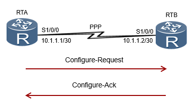

如图所示，RTA和RTB使用串行链路相连，运行PPP。当物理层链路变为可用状态之后，RTA和RTB使用LCP协商链路参数。本例中，RTA首先发送一个Configure-Request报文，此报文中包含RTA上配置的链路层参数。当RTB收到此Configure-Request报文之后，如果RTB能识别并接受此报文中的所有链路层参数，则向RTA回应一个Configure-Ack报文。

RTA在没有收到Configure-Ack报文的情况下，会每隔3秒重传一次Configure-Request报文，如果连续10次发送Configure-Request报文仍然没有收到Configure-Ack报文，则认为对端不可用，停止发送Configure-Request报文。

注：完成上述过程只是表明RTB认为RTA上的链路参数配置是可接受的。RTB也需要向RTA发送Configure-Request报文，使RTA检测RTB上的链路参数是不是可接受的。

##### Configure-Nak

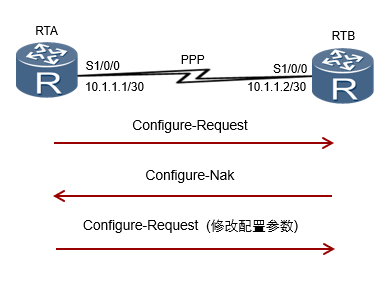

当RTB收到RTA发送的Configure-Request报文之后，如果RTB能识别此报文中携带的所有链路层参数，但是认为部分或全部参数的取值不能接受，即参数的取值协商不成功，则RTB需要向RTA回应一个Configure-Nak报文。

在这个Configure-Nak报文中，只包含不能接受的链路层参数，并且此报文所包含的链路层参数均被修改为RTB上可以接受的取值（或取值范围）。

在收到Configure-Nak报文之后，RTA需要根据此报文中的链路层参数重新选择本地配置的其它参数，并重新发送一个Configure-Request。

##### Configure-Reject

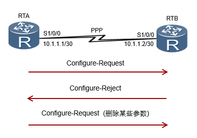

当RTB收到RTA发送的Configure-Request报文之后，如果RTB不能识别此报文中携带的部分或全部链路层参数，则RTB需要向RTA回应一个Configure-Reject报文。在此Configure-Reject报文中，只包含不能被识别的链路层参数。

在收到Configure-Reject报文之后，RTA需要向RTB重新发送一个Configure-Request报文，在新的Configure-Request报文中，不再包含不被对端（RTB）识别的参数。

#### PPP基本配置

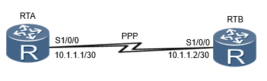

```bash
[RTA]interface Serial 1/0/0 

[RTA-Serial1/0/0]link-protocol ppp

Warning: The encapsulation protocol of the link will be changed. Continue? [Y/N]:y 

[RTA-Serial1/0/0]ip address 10.1.1.1 30
```

建立PPP链路之前，必须先在串行接口上配置链路层协议。华为ARG3系列路由器默认在串行接口上使能PPP协议。如果接口运行的不是PPP协议，需要运行**link-protocol** **ppp**命令来使能数据链路层的PPP协议。

#### PPP认证模式

PPP Authentication 是可以双向设置认证的。

##### PAP

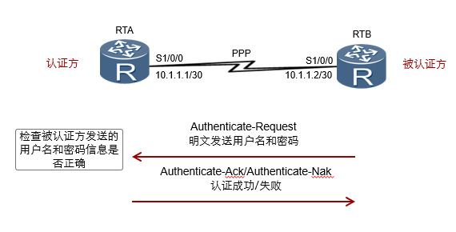

PAP（Password Authentication Protocol，密码认证协议）认证的工作原理较为简单。PAP认证协议为两次握手认证协议，发起方为被认证方，这就导致被认证方可以做无限次的尝试（暴力破解），只在链路建立的阶段进行认证，一旦链路建立成功将不再认证。密码以明文方式在链路上发送。

LCP协商完成后，认证方要求被认证方使用PAP进行认证。

被认证方将配置的用户名和密码信息使用Authenticate-Request报文以明文方式发送给认证方。

认证方收到被认证方发送的用户名和密码信息之后，根据本地配置的用户名和密码数据库检查用户名和密码信息是否匹配，如果匹配，则返回Authenticate-Ack报文，表示认证成功。否则，返回Authenticate-Nak报文，表示认证失败。

##### CHAP

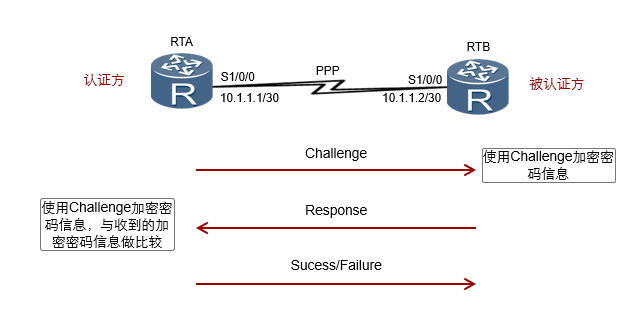

CHAP(Challenge Handshake Authentication Protocol，挑战/质询握手认证协议)认证过程需要三次报文的交互（3 times handshakes）。为了匹配请求报文和回应报文，报文中含有Identifier字段，一次认证过程所使用的报文均使用相同的Identifier信息。

1.LCP协商完成后，认证方发送一个Challenge报文给被认证方，报文中含有Identifier信息和一个随机产生的Challenge字符串，此Identifier即为后续报文所使用的Identifier。

2.被认证方收到此Challenge报文之后，进行一次加密运算，运算公式为MD5{ Identifier＋密码＋Challenge }，意思是将Identifier、密码和Challenge三部分连成一个字符串，然后对此字符串做MD5运算，得到一个16字节长的摘要信息，然后将此摘要信息和端口上配置的CHAP用户名一起封装在Response报文中发回认证方。

3.认证方接收到被认证方发送的Response报文之后，按照其中的用户名在本地查找相应的密码信息，得到密码信息之后，进行一次加密运算，运算方式和被认证方的加密运算方式相同，然后将加密运算得到的摘要信息和Response报文中封装的摘要信息做比较，相同则认证成功，不相同则认证失败。

*为何使用CHAP认证方式相比于PAP更安全？*

​	1.**加密**：被认证方的密码是被加密后才进行传输的

​	2.**防暴力破解**：由认证方发起认证，有效避免暴力破解。

​	3.**再认证**：在链路建立成功后具有再次认证检测机制

因为上述安全性，所以CHAP目前在企业网的远程接入环境中用的比较常见。

#### IPCP静态地址协商

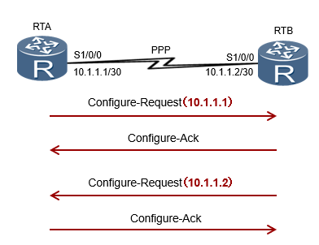

IPCP使用和LCP相同的协商机制、报文类型，但IPCP并非调用LCP，只是工作过程、报文等和LCP相同。

IP地址协商包括两种方式：静态配置协商和动态配置协商。

如图所示，两端路由器配置的IP地址分别为10.1.1.1/30和10.1.1.2/30。

静态IP地址的协商过程如下：

1. 每一端都要发送Configure-Request报文，在此报文中包含本地配置的IP地址；

2. 每一端接收到此Configure-Request报文之后，检查其中的IP地址，如果IP地址是一个合法的单播IP地址，而且和本地配置的IP地址不同（没有IP冲突），则认为对端可以使用该地址，回应一个Configure-Ack报文。

#### IPCP动态地址协商

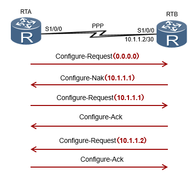

两端动态协商IP地址的过程如下：

1.RTA向RTB发送一个Configure-Request报文，此报文中会包含一个IP地址0.0.0.0，表示向对端请求IP地址；

2.RTB收到上述Configure-Request报文后，认为其中包含的地址（0.0.0.0）不合法，使用Configure-Nak回应一个新的IP地址10.1.1.1；

3.RTA收到此Configure-Nak报文之后，更新本地IP地址，并重新发送一个Configure-Request报文，包含新的IP地址10.1.1.1；

4.RTB收到Configure-Request报文后，认为其中包含的IP地址为合法地址，回应一个Configure-Ack报文。

同时，RTB也要向RTA发送Configure-Request报文请求使用地址10.1.1.2，RTA认为此地址合法，回应Configure-Ack报文。

#### PPP Authentication Configuration

##### PAP认证Configuration


```
[RTA]aaa 
[RTA-aaa]local-user huawei password cipher huawei123	#命令用于创建一个本地用户，用户名为“huawei”，密码为“huawei123”，关键字“cipher”表示密码信息在配置文件中被加密。
[RTA-aaa]local-user huawei service-type ppp 	#命令用于设置用户“huawei”为PPP用户。
[RTA]interface Serial 1/0/0  
[RTA-Serial1/0/0]link-protocol ppp
[RTA-Serial1/0/0]ppp authentication-mode pap	#命令用于在认证方开启PAP认证的功能，即要求对端使用PAP认证。
[RTA-Serial1/0/0]ip address 10.1.1.1 30
```

```
[RTB]interface Serial 1/0/0  
[RTB-Serial1/0/0]link-protocol ppp
[RTB-Serial1/0/0]ppp pap local-user huawei password cipher huawei123 	#命令用于在被认证方配置PAP使用的用户名和密码信息。
[RTB-Serial1/0/0]ip address 10.1.1.2 30
```

###### 配置验证

```
<RTB>debugging ppp pap all
Mar 20 2016 04:50:24.280.4+00:00 RTB PPP/7/debug2:
  PPP State Change: 
      Serial1/0/0 PAP : Initial --> SendRequest 
Mar 20 2016 04:50:24.290.3+00:00 RTB PPP/7/debug2:
  PPP State Change: 
      Serial1/0/0 PAP : SendRequest --> ClientSuccess
……
```

##### CHAP认证模式 Configuration


```
[RTA]aaa 
[RTA-aaa]local-user huawei password cipher huawei123	#命令用于创建一个本地用户，用户名为“huawei”，密码为“huawei123”；关键字“cipher”表示密码信息在配置文件中加密保存。
[RTA-aaa]local-user huawei service-type ppp 	#命令用于设置用户“huawei”为PPP用户。
[RTA]interface Serial 1/0/0  
[RTA-Serial1/0/0]link-protocol ppp
[RTA-Serial1/0/0]ppp authentication-mode chap	#命令用于在认证方开启CHAP认证的功能，即要求对端使用CHAP认证。
```

```
[RTB]interface Serial 1/0/0  
[RTB-Serial1/0/0]link-protocol ppp
[RTB-Serial1/0/0]ppp chap user huawei	#命令用于在被认证方设置CHAP使用的用户名为“huawei”。
[RTB-Serial1/0/0]ppp chap password cipher huawei123	#命令用于在被认证方设置CHAP使用的密码为“huawei123”。
```

###### 配置验证

```
<RTB>debugging ppp chap all
Mar 20 2016 05:15:54.230.1+00:00 RTB PPP/7/debug2:
PPP State Change: 
      Serial1/0/0 CHAP : Initial --> ListenChallenge 
Mar 20 2016 05:15:54.230.7+00:00 RTB PPP/7/debug2:
  PPP State Change: 
      Serial1/0/0 CHAP : ListenChallenge --> SendResponse 
Mar 20 2016 05:15:54.250.3+00:00 RTB PPP/7/debug2:
  PPP State Change: 
      Serial1/0/0 CHAP : SendResponse --> ClientSuccess 
……
#该配置验证eNSP我看不到，不知道是不是模拟器的原因
```

#### Q

发送端在发送Configure-Request之后，收到哪个消息才能表示PPP链路建立成功？

如果使用PPP作为链路层封装协议，需要建立PPP链路的两端设备都必须发送Configure-Request报文，当每个设备均已收到对端发来的Configure-Ack报文后，就表示链路的建立过程已成功完成。


CHAP认证方式需要交互几次报文？

CHAP认证协议为三次握手认证协议，需要交互三次报文来认证对方身份。

## IPv6
RIR=区域互联网注册机构
 
win里
以太网适配器 VMware Network Adapter VMnet8:
```
   连接特定的 DNS 后缀 . . . . . . . :
   本地链接 IPv6 地址. . . . . . . . : fe80::576d:4b37:cb2e:bbeb%19
```
`%19`不是IPv6的部分
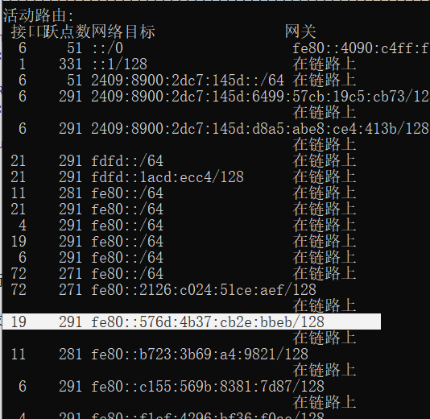
 
IPv6没有mask，只有前缀。

IPv6 Addr 和GW Addr不像IPv4，可以没有联系。

GUA=Global unicast addresses