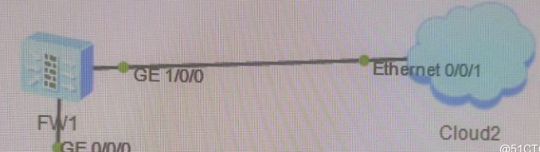

Topo如图所示


在设置Cloud之前，先要添加Loopback网卡，以便于将其绑定到Cloud。其实我第一次绑定的是VirtualBox Host Only Network，最后本机也能ping到FW，可是就是登陆不上FW的web。所以建议老老实实用环回网卡。

Cloud设置

1.添加绑定UDP

2.添加绑定Loopback网卡(我这里是以太网2)

3.端口映射设置 出端口改为2，勾选双向通道，然后点击增加。


FW设置

1.由于我的示例中，连接Cloud的是g1/0/0。所以要将g1/0/0加入zone trust 。若连接Cloud的是g0/0/0，由于g0/0/0默认是在zone trust，所以可以省略此步。

```
[FW]firewall zone trust
[FW-zone-trust] add interface GigabitEthernet1/0/0
```
2.进入g1/0/0绑定IP。
3. g1/0/0开启所有service。这步容易遗忘，但异常重要。不然登不进web，外面的设备也ping不到FW。

```
[FW-GigabitEthernet1/0/0]service-manage all permit
```


最后浏览器访问g1/0/0绑定的IP，可能打开会慢一些，不会秒开。