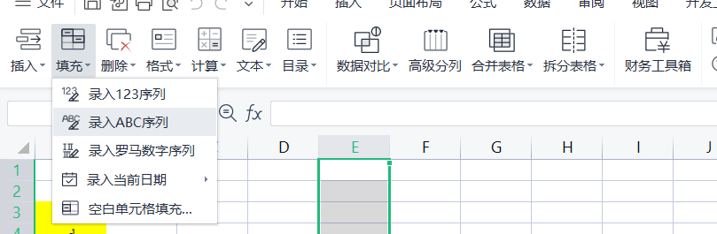

### 删除每个单元格的开头序号

数据----分列----分隔符号----其他----完成 ，成功

### 填充字母

录入序列

若想得到小写字母，使用`=LOWER()`

### 删除文本或excel表格内包含某一字符的所有行

1.查找字符串

2.按Ctrl+A选中所有的查找结果。

3.直接在任意有绿色标记的一行点击鼠标右键（不要在行首右击)，选择删除。

4.弹出选择框，选“整行”。
