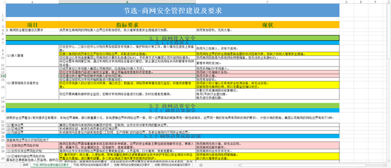
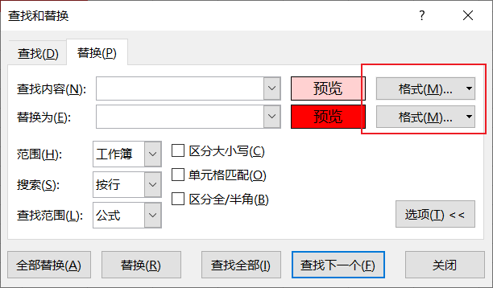
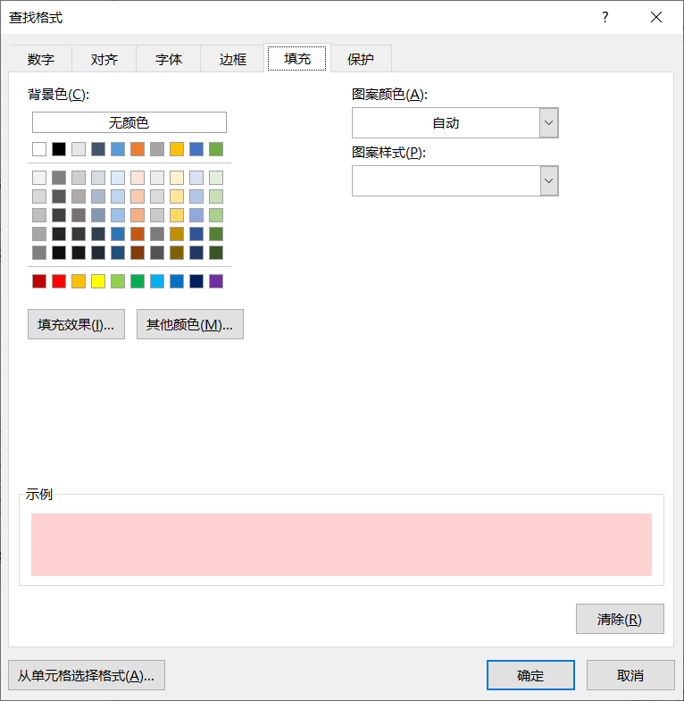

> 如图，有多种颜色的单元格。我想将粉色单元格的背景色批量更换成黑色，并且将文字统一换成红色。我该怎么做？
>
> In Excel, how to change cells’ color & text’s color based on original color?
>
> As shown in the figure, there are a lot of cells with different colors. I want to change the color of pink cells to Black , and the color of text to Red. What should I do ?
>
> 

不要选择`从单元格选择格式`，因为效果不能尽如人意。可能同一填充颜色的不同单元格还存在其他格式上的差异。所以无法做到特定填充颜色的所有单元格替换填充颜色。

推荐使用

