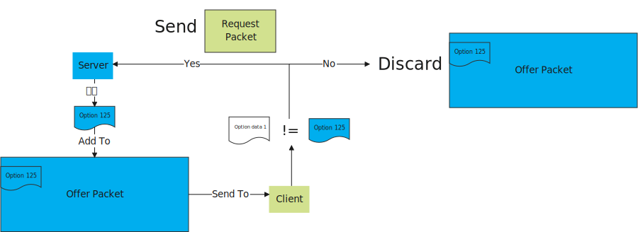

DHCP option 125（Vendor-ldentifying Vendor Options）：

官方定义：option 125是对标准DHCP协议一个补充标准，作用就是让客户端对DHCP服务器也进行认证，防止DHCP服务器伪造。

个人总结：
option 125 是client 用来验证server 的，client 不需要发送option 125，而是server在分配IP地址等信息时，将验证信息封装在option 125，然后添加到offer 包里面。client 在收到offer包之后先判断“option data 1”与之前存放的信息是否相同，相同则给这个server发送request包，不同则丢弃。

