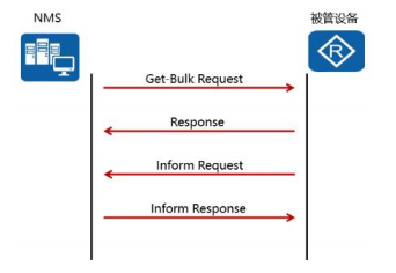
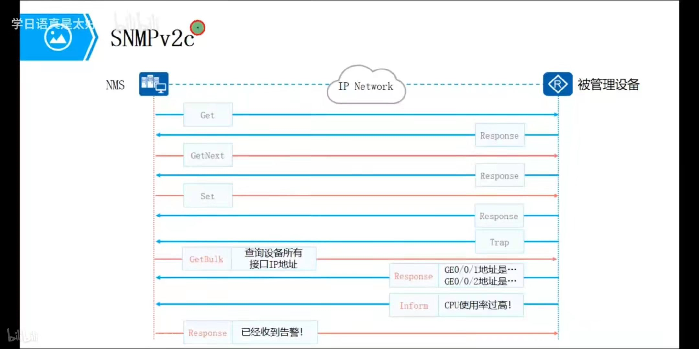

## 什么是SNMP？

简单网络管理协议（SNMP，Simple Network Management Protocol） 是专门设计用于在 IP 网络管理网络节点（服务器、工作站、路由器、交换机及HUBS等）的一种标准协议，它是一种应用层协议。[SNMP](https://www.comparitech.com/net-admin/snmp/) is one of the most widely-used monitoring protocols in the world.Countless network hardware manufacturers include SNMP with devices to make it easier for an enterprise to monitor infrastructure.

## SNMP的原理

NMS 是运行在网管主机上的网络管理软件。网络管理员通过操作 NMS，向被管理设备发出请求，从而可以监控和配置网络设备。

 Agent 是运行在被管理设备上的代理进程，无需运维人员安装。被管理设备在接收到 NMS 发出的 请求后，由 Agent 作出响应操作。Agent 的主要功能包括：收集设备状态信 息、实现 NMS 对设备的远程操作、向 NMS 发送告警消息。 

管理信息库 MIB（Management Information Base）是一个虚拟的数据库，是 在被管理设备端维护的设备状态信息集。Agent 通过查找 MIB 来收集设备状态信息。

## SNMP 应用场景

SNMP 用来在网络管理系统 NMS 和被管理设备之间传输管理信息
1、用于监控网络设备状态（网络设备中心）
2、设备报警（设备端口故障，发送信息给网管）
3、跨三层传送MAC（与上网行为管理配合，限制公司电脑操作）

## SNMP 版本

### SNMPv1

| Get-Resquet                      | Response                   | Get-Next-Resquet | Set-Resquet                | Trap                                         |
| -------------------------------- | -------------------------- | ---------------- | -------------------------- | -------------------------------------------- |
| 向代理进程的数据库获取(提取)参数 | 代理进程会返回请求的参数值 | 提取下一个参数   | 设置代理进程中数据库的参数 | 代理进程向网管系统发送告警，例如短信、邮件。 |

### SNMPv2c

SNMPv2c（c stands for community，相当于明文密码）也采用团体名认证。支持更多的数据类型（Counter32等）

#### 更多的操作报文

在兼容SNMPv1的同时又扩充了SNMPv1的功能，即SNMPv2c新增了GetBulk操作报文和inform操作报文。

| Get-Bulk-Resquet                                             | Inform- Resquet                                              |
| ------------------------------------------------------------ | ------------------------------------------------------------ |
| 执行多个 Get-Resquet 的操作。通过对Non repeaters和Max repetitions参数的设定，高效率地从Agent获取大量管理对象数据。 | 相当于Trap的升级版。但是Inform报文发出后需要网管系统进行确认，才能收到响应报文，没有回应则一直发送或到达最大发送次数。 |

#### 提供了更丰富的错误代码

在v1版本中只有数据类型的错误码，而v2c版本中增加了不少，能够更细致地区分错误。

### SNMPv3

### 3代安全性比较

<table>
    <tr><th>SNMP版本</th><th>身份认证</th><th>加密</th></tr>
    <tr><th>SNMPv1</th><td>×</td><td>×</td></tr>
    <tr><th>SNMPv2c</th><td>√</td><td>×</td></tr>
    <tr><th>SNMPv3</th><td>√</td><td>√</td></tr>
</table>

<table>
    <tr><td>SNMPv1</td><td>网管端工作站上的 NMS 与被管理设备上的 Agent 之间，通过交互 SNMPv1 报文，可以实现网管端对被管理设备的管理。SNMPv1 基本上没有什么安全性可言。</td></tr>
    <tr><td>SNMPv2c</td><td>在继承 SNMPv1 的基础上，其性能、安全性、机密性等方面都有了大的改进。</td></tr>
    <tr><td>SNMPv3</td><td>在 SNMPv2 基础之上增加、完善了安全和管理机制。SNMPv3 体系结 构体现了模块化的设计思想，使管理者可以方便灵活地实现功能的增加和修 改。SNMPv3 的主要特点在于适应性强，可适用于多种操作环境，它不仅可以 管理最简单的网络，实现基本的管理功能，也可以提供强大的网络管理功能，满足复杂网络的管理需求。
</td></tr>
</table>

## SNMP Experiment

可使用免费的**SnmpB**作为Network Management Software

1.在空白处右键，选择New agent profile.在右侧的General Properties修改Name、Agent Addr。选择对应的Version。

Right Click on the blank space. Select New agent profile. Update Name、Agent Addr in right side. Select SNMP Version.

2.填上Community

3.在主界面可进行具体操作

主界面

