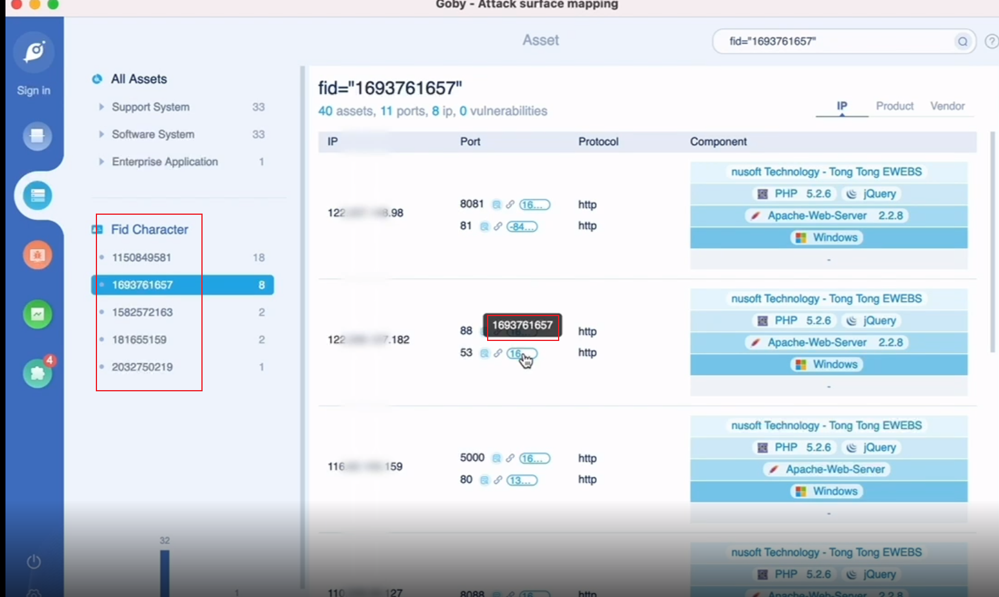

#### **FID - Web特征数据**

资产中新增 FID 功能，一种新的 Web 特征数据维度，它能够快速定位原先的无特征资产，在发现的资产没有域名、没有证书、没有 logo 等等不利资产收集的情况下，提供一种非常实用的新维度 FID 来聚类相同资产，节省特征提取的时间，快人一步定位到目标。FID 作为 Goby 本次更新的最重磅功能，凭借自动化特征提取的技术创新成为资产发现领域的大杀器。

FID 在未知资产发现、自动聚类网站、资产指纹扩充、实时获取资产情报、HW 资产梳理以及其他潜在场景的应用还有很多。

支持对未确定的 Fid 特征进行自定义规则添加，以及完全自定义规则添加，形成自己的 Goby 规则库，**用于扩大资产识别覆盖面，让指纹录入更加灵活快捷。**

<video src=".assets/FID.mp4"></video>

进入资产列表页，点击左侧 Fid Character 标题后的+按钮（或右侧工具栏，或资产默认页的规则管理入口），进入规则管理页。在该页面，能看到三个选项卡，从左到右依次为全部规则、全部线索，以及右上角的自定义规则按钮。

(1) **全部规则列表（All Rules）**为本地 Goby 所有自定义的规则（包括已添加和已拉黑两部分），支持编辑、拉黑、删除。

(2) **全部线索列表（All Cules）**为当前任务未确认的 Fid 特征，支持添加、拉黑、查看。**只需手动****一键录入规则，即可添加到 All rules 列表，即定即用，比人工更轻松，更全面，更快捷。**

可通过添加功能将 Fid 加到全部规则的列表里，之后扫描就会识别该 Fid 对应的资产。

可通过拉黑功能将 Fid 加到全部规则的列表里，之后扫描就不会识别该 Fid 对应的资产。

可通过查看功能看 Fid 的详细信息。

(3) 自定义规则按钮则可以完全自定义 rule，不用受限于 Fid 特征，更加灵活。

通过该方式添加的自定义规则也会加到全部规则的列表里。

> 其他版本仅支持加载前 20 条自定义规则，升级企业版可解除该限制！