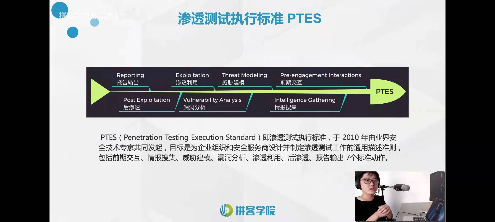

1. Pre-engagement Interactions:与客户沟通，拿到客户授权,确定授权范围、客户想要的结果。确定Hacking目标,Domain Name,IP Addr。
2. Intel Gathering:根据Pre-engagement Interactions中客户提供的信息以及授权范围，去收集IP、Port、系统、漏洞等相关信息。
3. Threat Modeling：根据Intel Gathering收集到的Intel，进行Modeling、前期分析。经典的分析思路如下：
   - 开了什么端口？
   - 提供了何种服务？
   - 服务所对应的软件version是什么，
   - 软件是否曾经出现过漏洞、
   - 根据过去的漏洞能否找到对应的Exploit(漏洞利用)以进行hacking？
4. Vul Analysis:根据Threat Modeling得到的exp，以确认利用何种exp去攻击哪个目标。
5. Exp：利用现有的Intel和工具开始攻击，拿到权限。
6. Post Exp：尝试通过措施，拿到更持久的控制权限。获取数据、擦除痕迹。

Reconnaissance：类似于PTES里的Intel Gathering。

Weaponization：图中的“malicious code”包括exp、工具。

Delivery：通过水坑、鱼叉式攻击、邮件欺诈等方式，尝试让攻击目标接收到恶意代码。

Command & Control：常称为C2。

Cyber Kill Chain相比于PTES更接近真实的Hacker攻击的流程。比如说，PTES有Pre-engagement Interactions，但Cyber Kill Chain无法接受用户主动提供的Intel。所以说，Cyber Kill Chain比PTES更受到推崇。

ATT&CK作为后起之秀，用户日趋增多。ATT&CK比起PTES和Cyber Kill Chain颗粒度要更细。ATT&CK的伟大在于无论何种攻击手段都可以基于ATT&CK模型进行归类。

[Matrix - Enterprise | MITRE ATT&CK®](https://attack.mitre.org/matrices/enterprise/)

TTP:攻击战术(Tactics)、攻击技术(Techniques)、流程(Process)

| Tactics                                                 | 翻译     |
| ------------------------------------------------------- | -------- |
| Initial Access                                          | 初始访问 |
| Execution                                               | 执行     |
| Persistence                                             | 持久化   |
| Privilege Escalation                                    | 权限提升 |
| Defense Evasion                                         | 防御绕过 |
| Credential Access                                       | 凭证     |
| Discovery                                               | 访问发现 |
| Lateral Movement                                        | 横向移动 |
| Collection                                              | 收集     |
| Command & Control                                       | 命令控制 |
| [Exfiltration](https://attack.mitre.org/tactics/TA0010) | 数据获取 |
| Impact                                                  | 影响     |

