讲解的是ATT&CK version8

## ATT&CK 背景、概述、作用   

> MITRE到底是什么样的研究机构？为何说它像是美国「神盾局」？ 

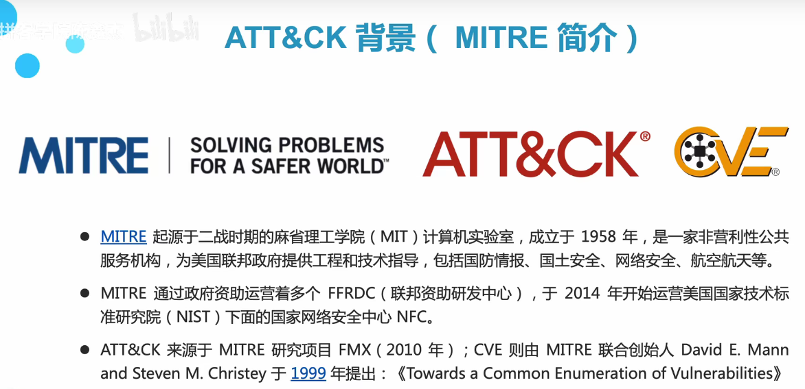

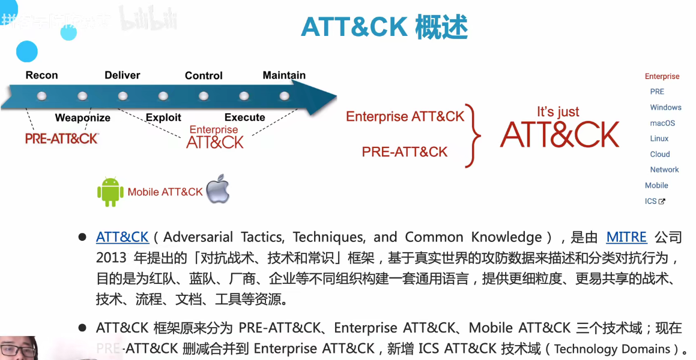

ICS,工业控制系统

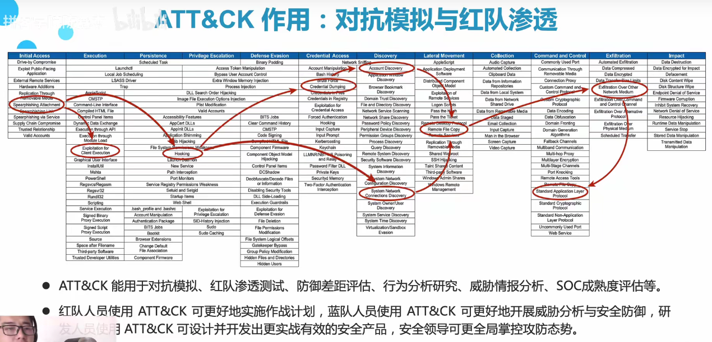

SOC，Security Operations Center，安全运营中心

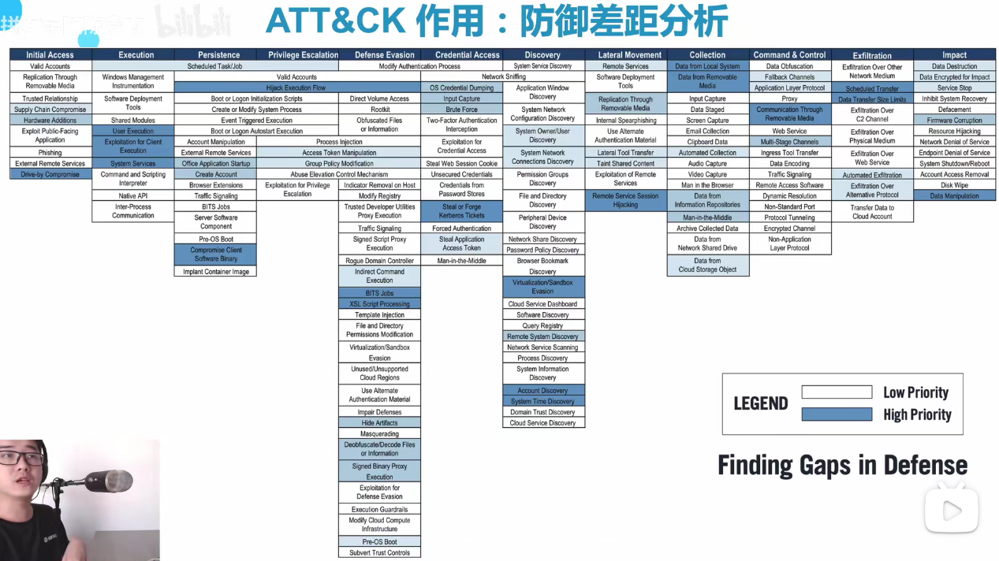

上图可以通过着色器，即ATT&CK导航器来绘制。

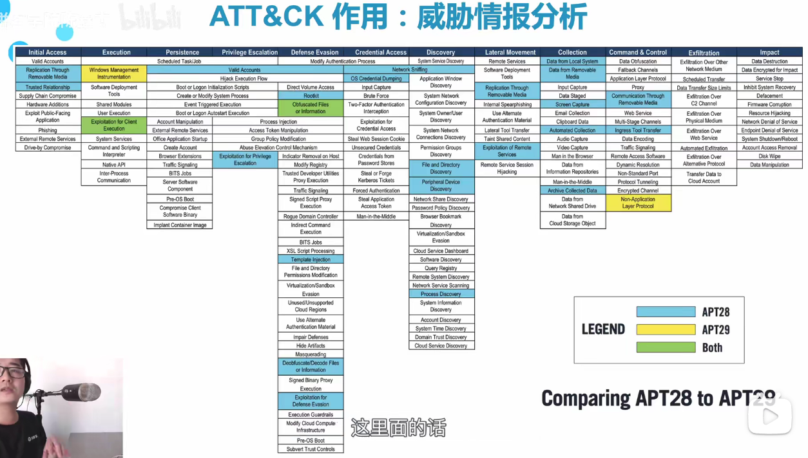

上图是在威胁情报分析中，将APT28&29进行比较，来分析作案手段的相似性。若高度相似，则可以判断两起案件可能是同一组织发起的。

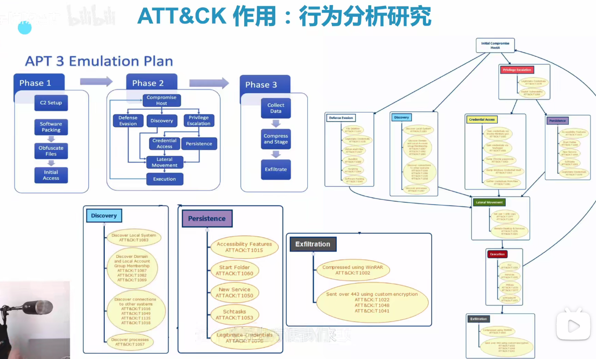

## ATT&CK 矩阵、战术、技术

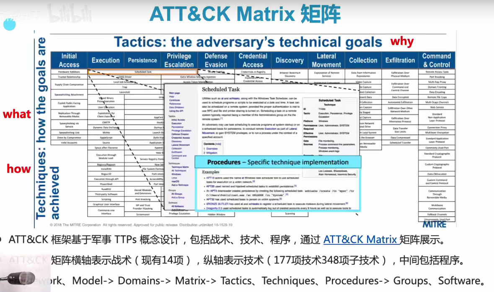

上图是v7.v8在初始访问之前还有侦察、资源开发2个战术。

Technique有时还包括Sub-Technique子技术。

在ATT&CK中，Model慢慢被Framework这个更宏观的词替代。

> ATT&CK基于军事领域TTPs进行设计，那么TTPs是啥？

Tactics战术、Techniques技术、Procedures程序

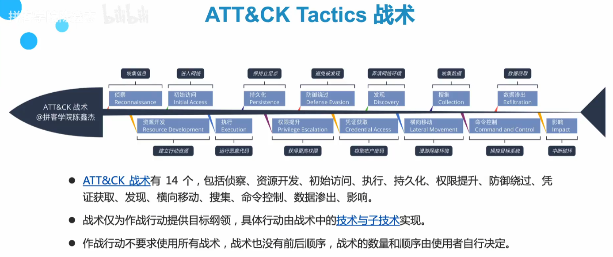

一般来说，战术用的越少，越难被发现。

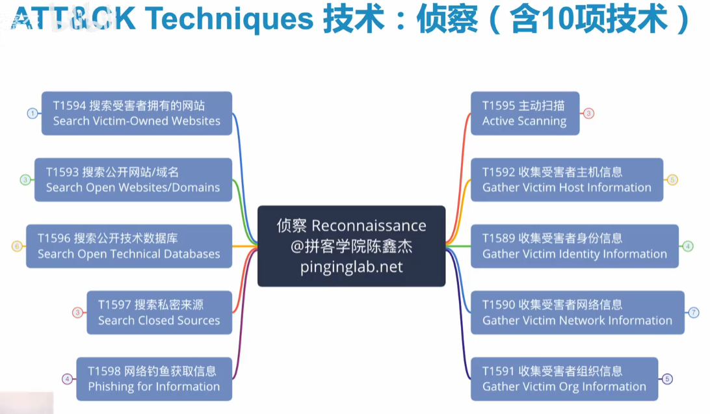

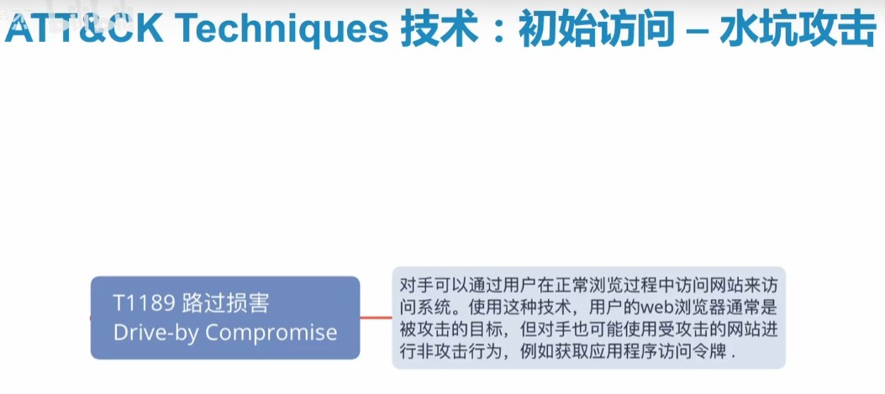

## ATT&CK 组织、缓解、关系

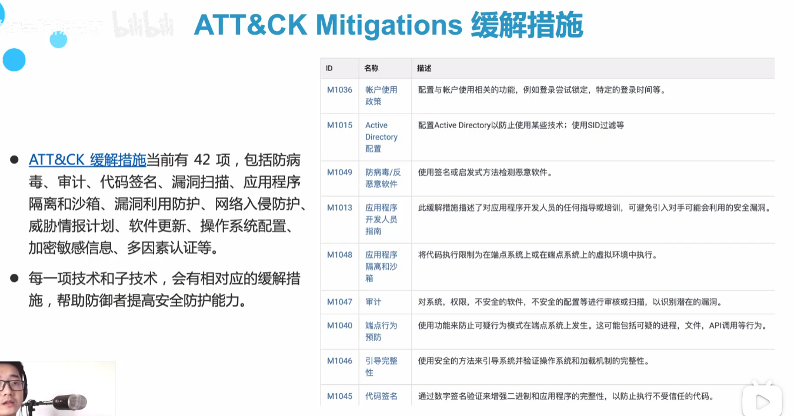

 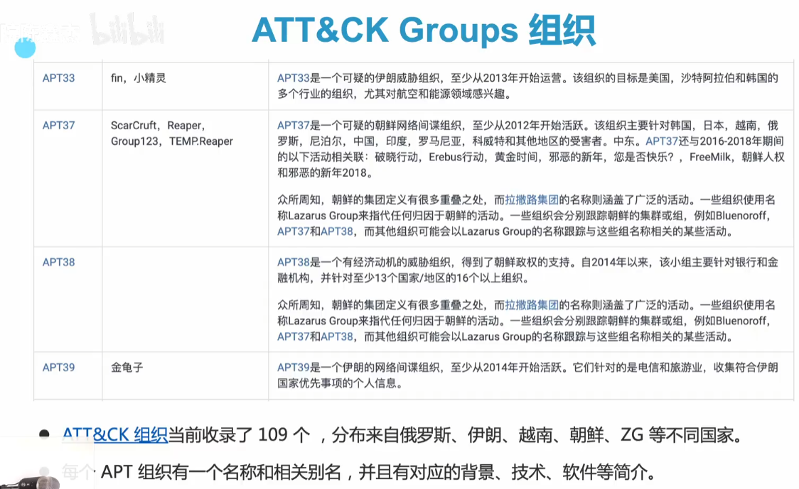

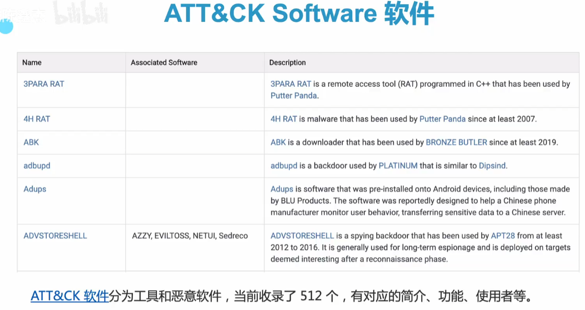

著名的ATT&CK Software：Cobalt Strike、Metasploit

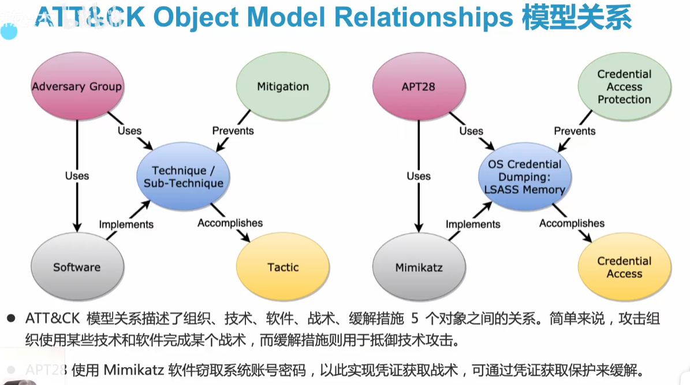

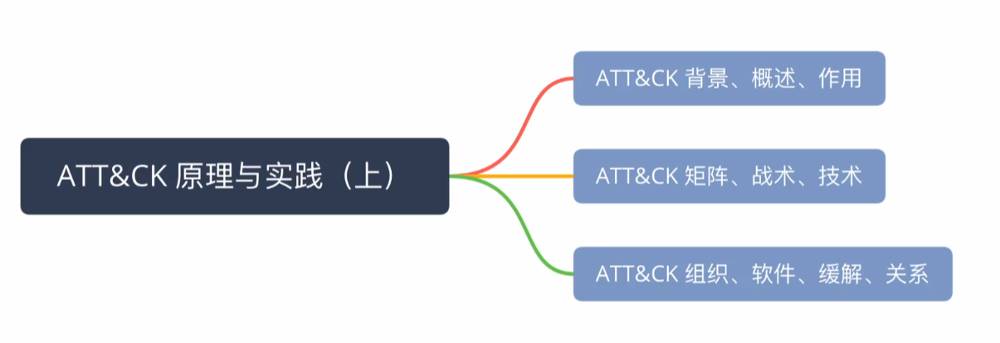

