CALDERA 网络安全红蓝对抗框架，可用于自动化红队行动、手工红队行动、 自动化应急响应等攻防实践  

## CALDERA 简介、组成、原理

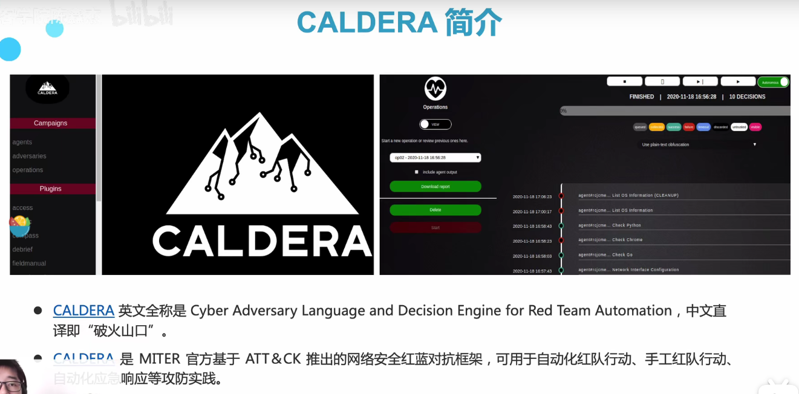

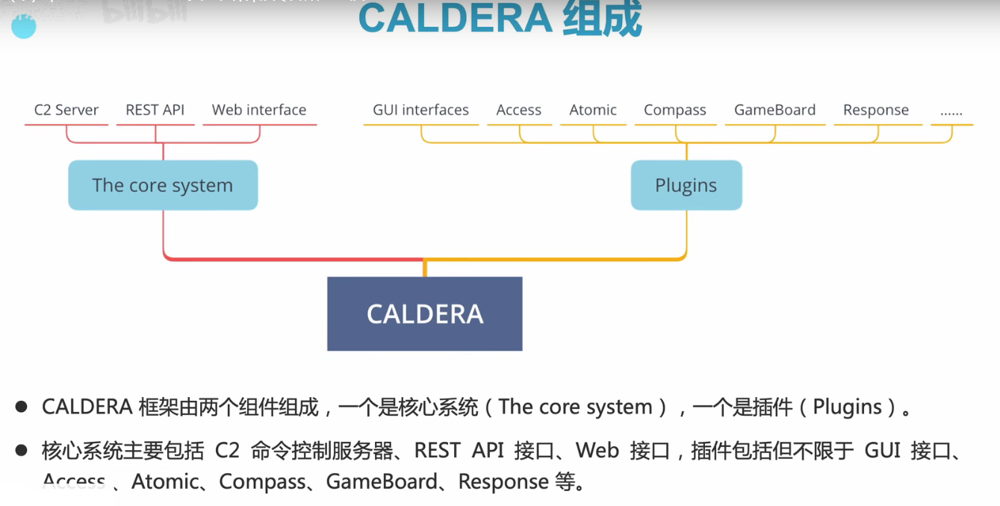

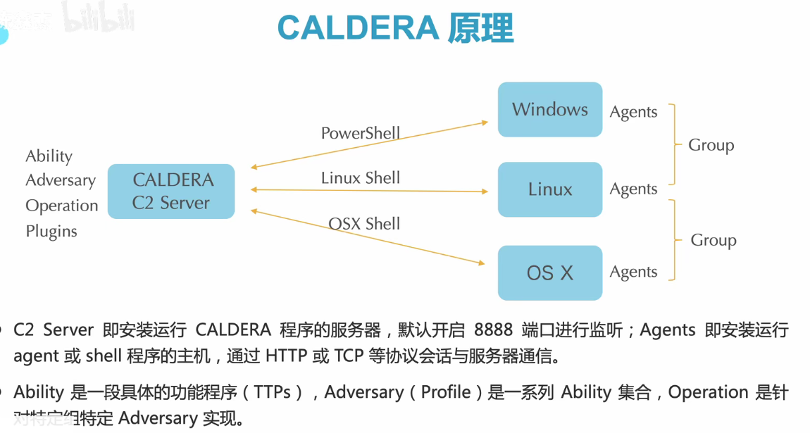

上图中，C2 server是攻击者，右边的各种终端是受害者。


## CALDERA 环境、安装、功能

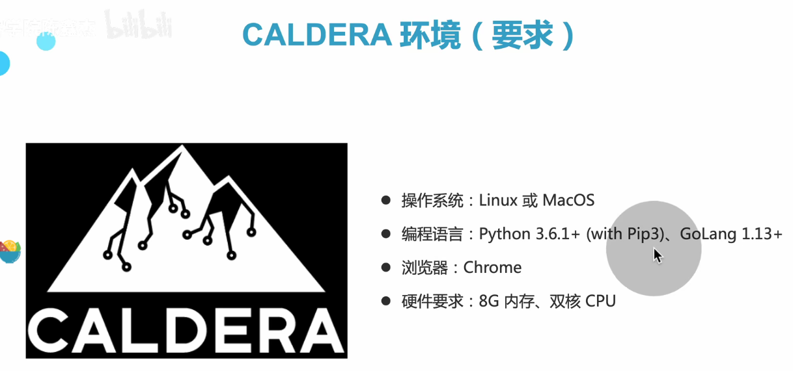

Caldera默认安装路径在/root。需sudo su进入超级用户权限，才能进入/root。

```bash
python3 server.py --insecure	
#运行服务，insecure一定要加上，不然登陆不进去
```

admin

#### 1.创建代理

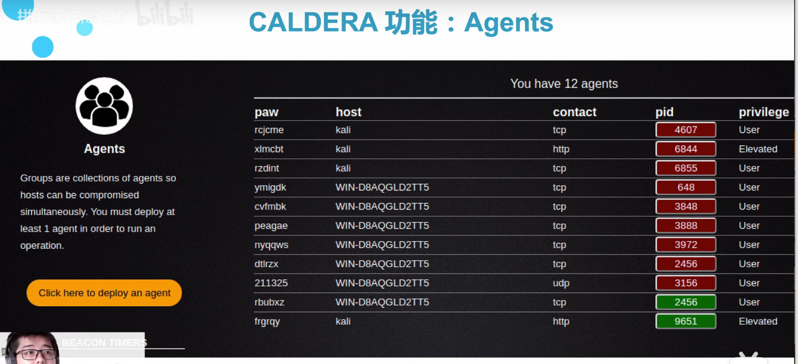

Agents，代理功能，也就是目前能够管控的主机。

Groups是代理集群，便于红队发起同时攻击。

Contact: Shell的通信协议，一般是tcp或者http

PID：目标主机上运行的进程号

Privilege： 红队目前拿到的权限。

点击Agent按钮生产shell代码，然后把这段代码放在agent里，运行。之后刷新，就可以看到主机上线了。

#### 2.配置

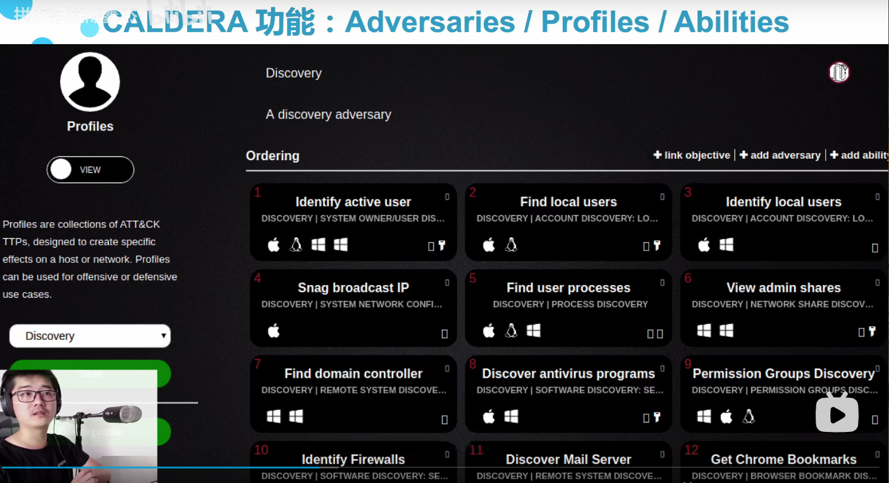

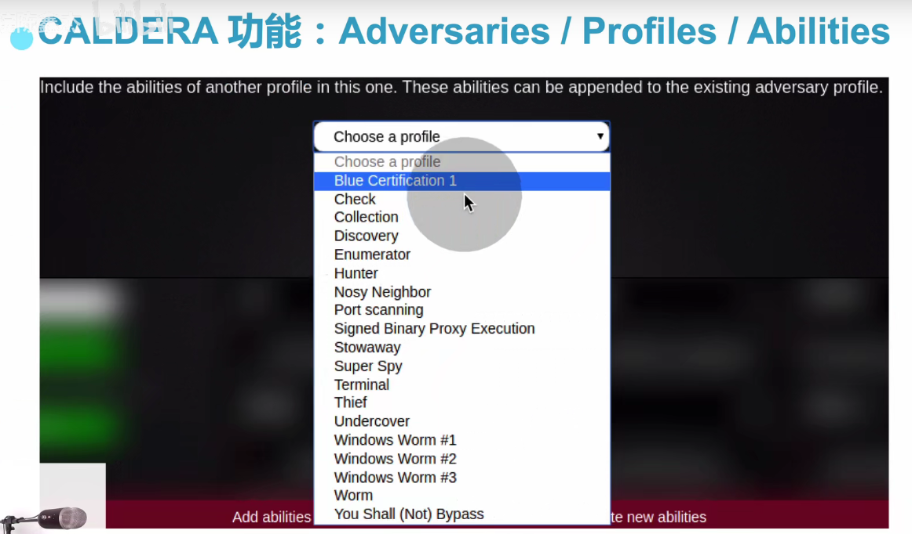

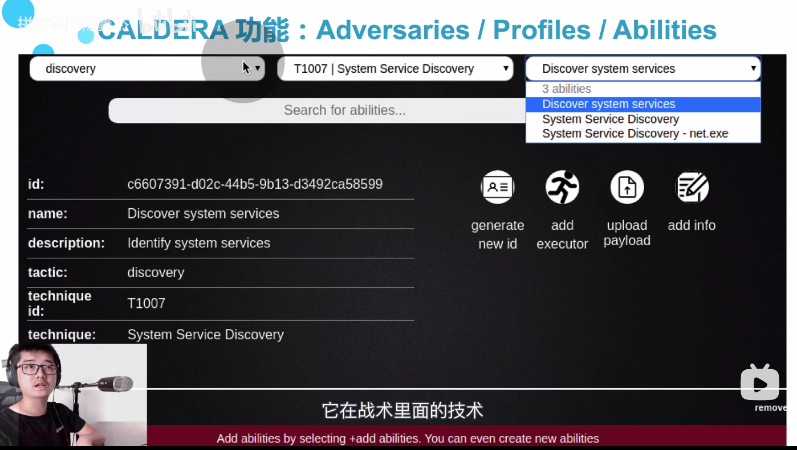

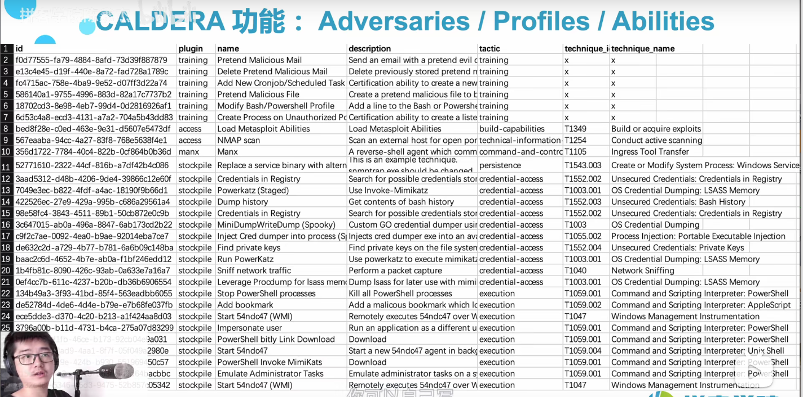

#### 3.Operation

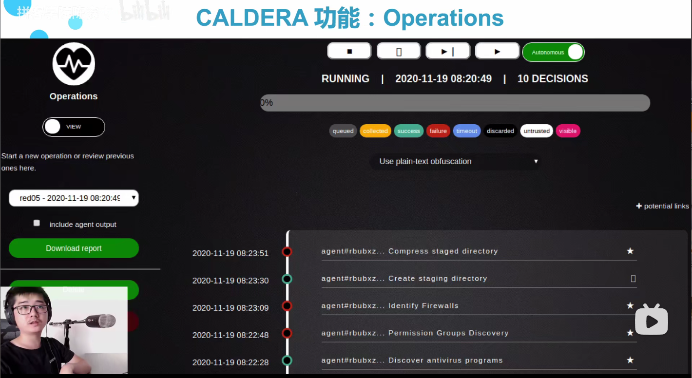

红色代表未执行成功，绿色代表执行成功。

上方有停止、下一步按钮。

实现操作自动化，无需敲代码。点击⭐可以去了解`命令`与`结果`，如何自动化渗透目标。

#### 4.报告分析

Debrief


## CALDERA 代理、配置、行动

CALDERA默认有3个账号

| Type           | User  | Code  |
| -------------- | ----- | ----- |
| 全局管理员账号 | admin | admin |
| 红队           | red   | admin |
| 蓝队           | blue  | admin |

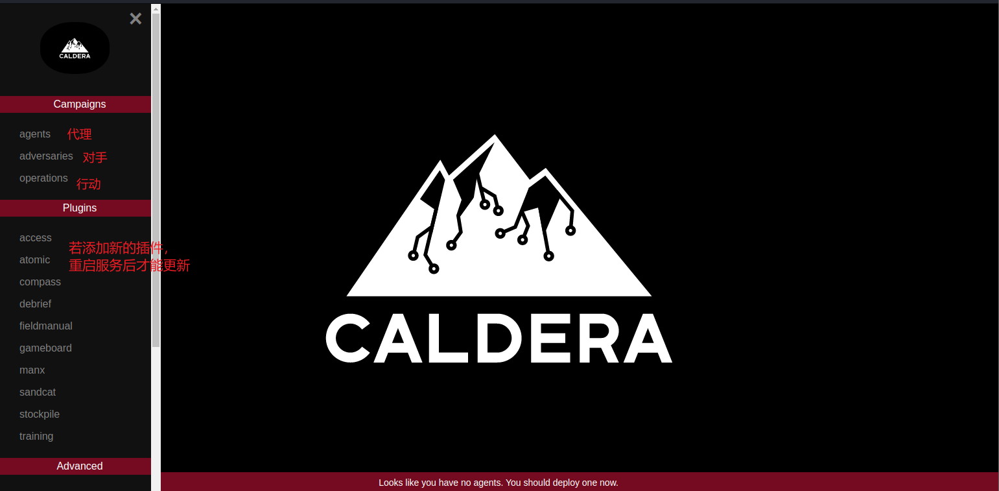

可以同时打开多个窗口，用滚轮浏览。

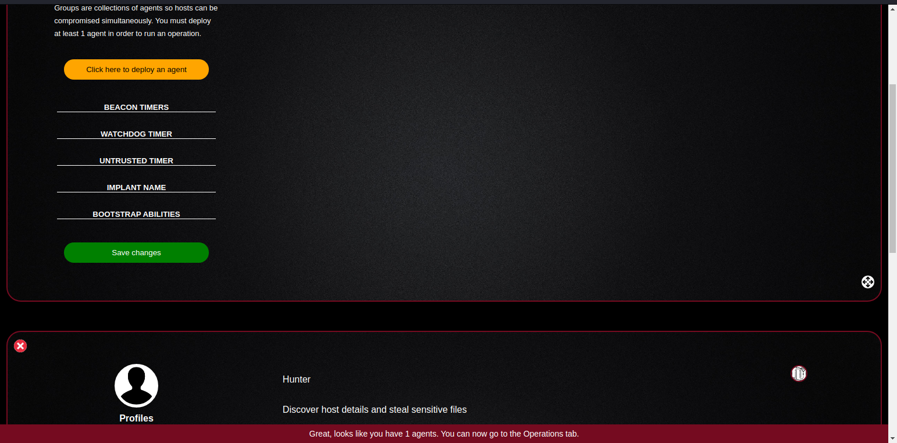

#### Agents

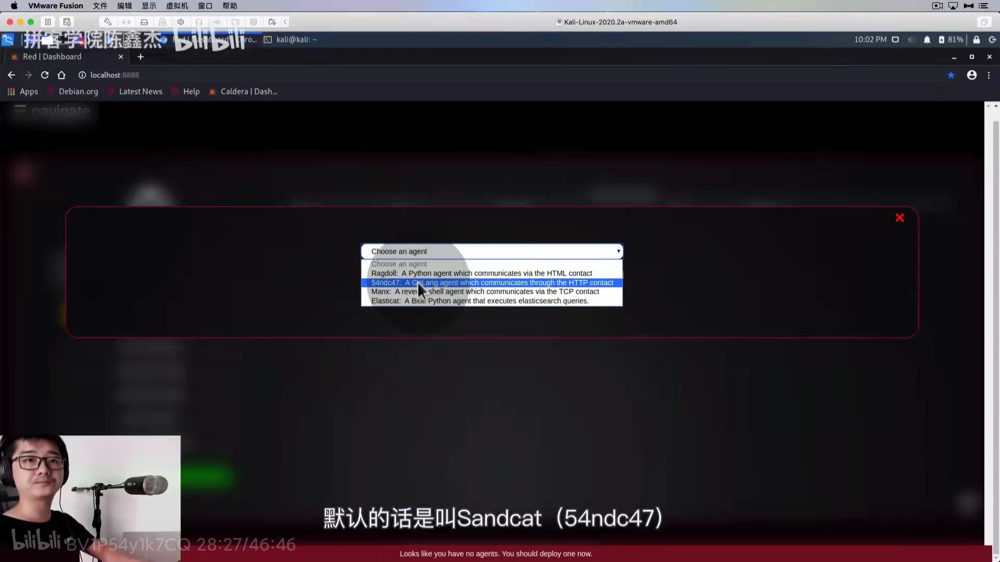

54ndc47就是Sandcat。关于名字的特点，我发现，5=S，4=a，7=t，用长得类似的数字代替某些字母。很好奇名字的来源。

平常我们用SandCat和Manx比较多。因为SandCat和Manx更稳定一些，报错率低一些。

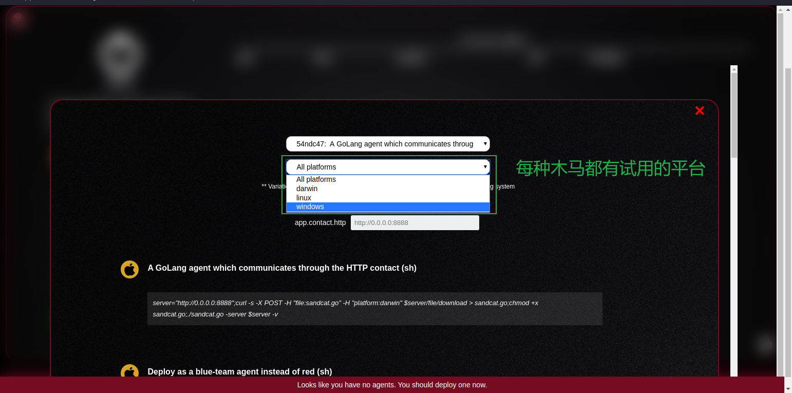

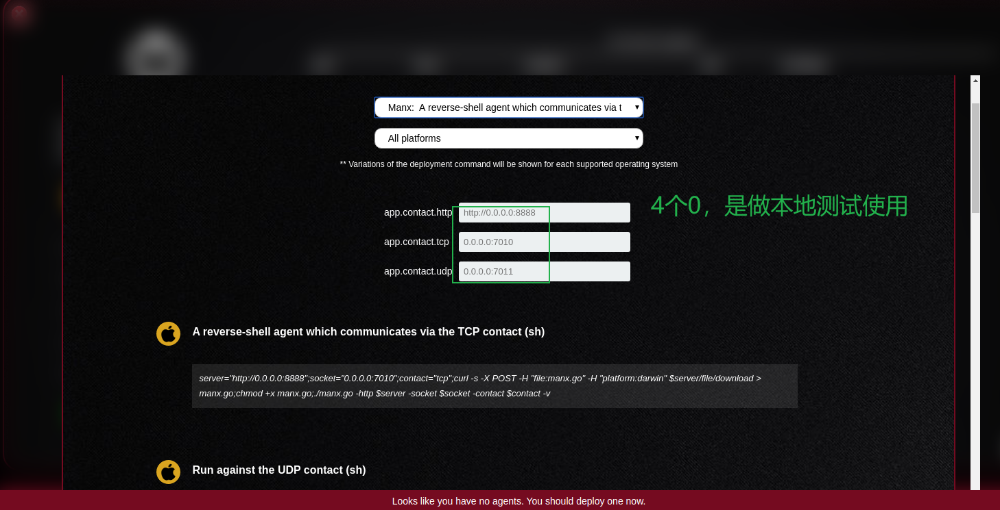

若我想做本地测试

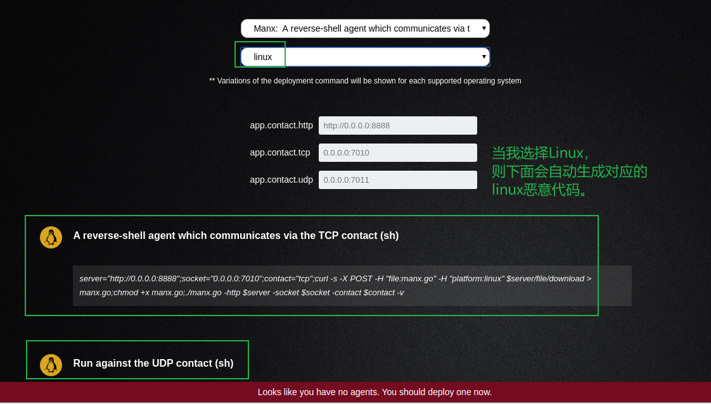


#### Adversaries(Profiles)

adversaries点进去后我们发现显示的是Profiles，指代的意思是一样的。可以看出来，CALDERA官方想用`Profiles`去替换adversaries。

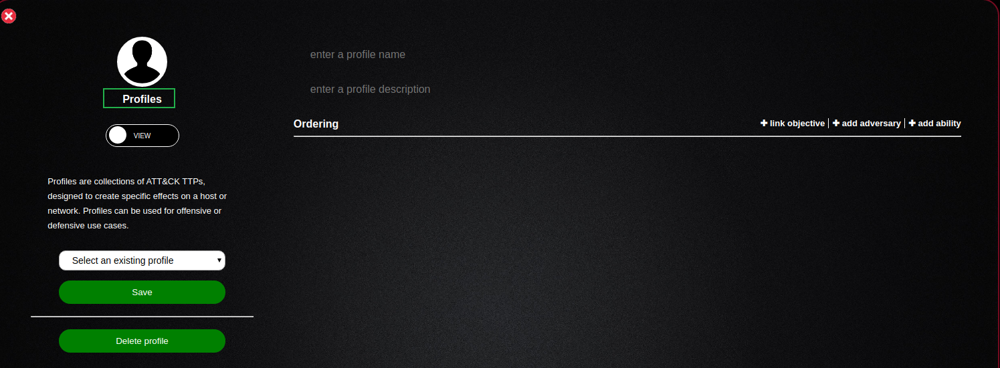

`Profiles`可实现红队自动化渗透。

#### Operations

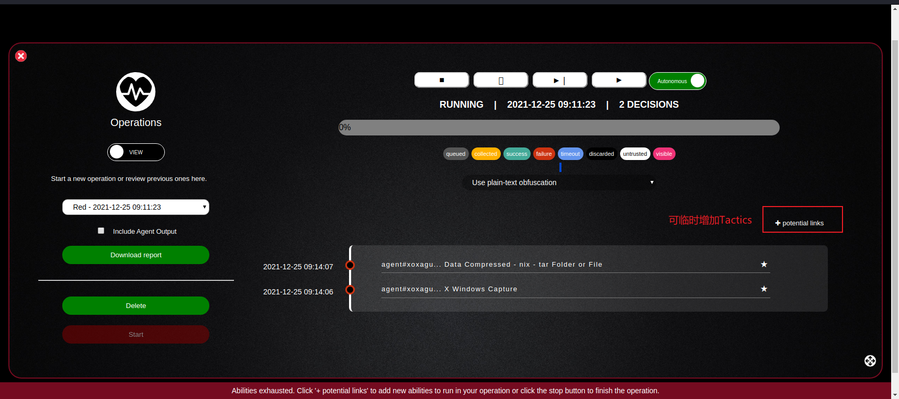

#### 实际操作示例

##### 1.配置Agent

我们先以本机kali作为agent

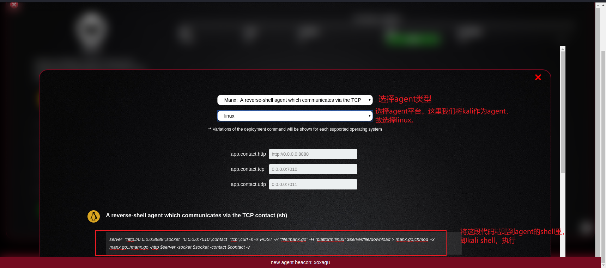

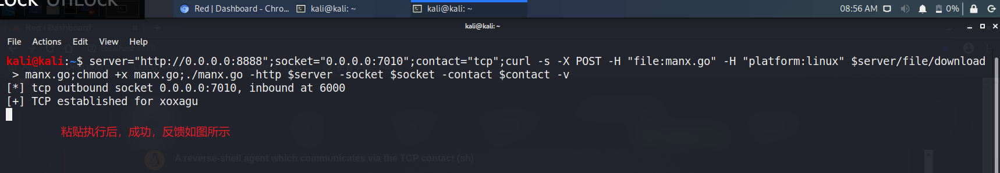

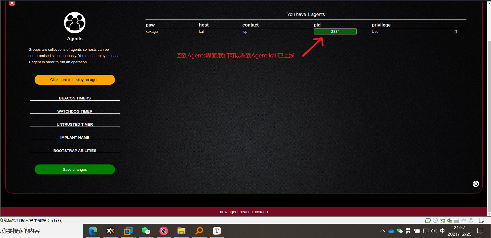

如上图所示，目前Agent kali的权限是User。

