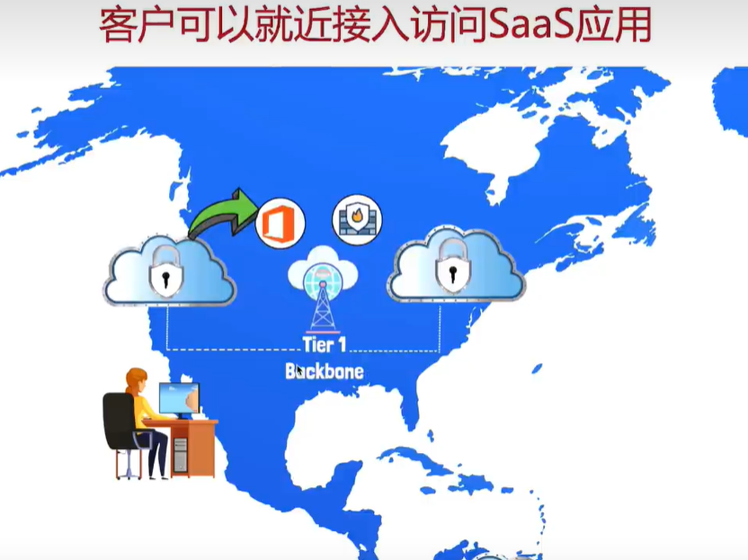
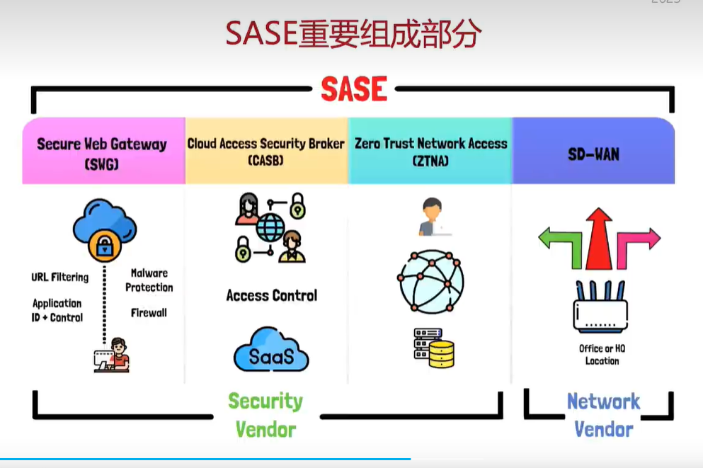
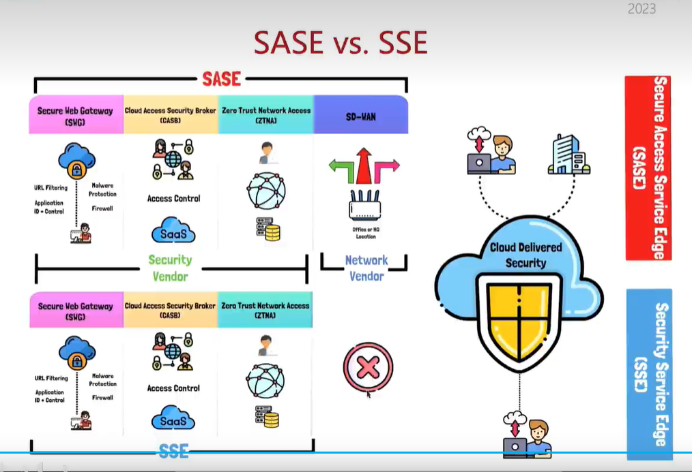

## VPN
中心化，速度慢。
## CASB
SASE的四大组件之一。

## SASE
### 就近接入，体验更快
可全球部署接入点，方便用户就近接入。比VPN快。

### 使用方便
无需拨号。用账密登录客户端即可。
### 管理方便
传统VPN需要根据地区区分策略，SASE策略统一。SASE支持未用户打标签，可根据标签定制安全策略。
### 更强大

SWG管web ACL，也可以防病毒。
**CASB**管理更广泛的ACL。
ZTNA可以将内部服务代理出来（反向代理）供用户访问。
四大组件，但凡少一个，都不能叫SASE。例如只能接客户，不能接分支机构，不能接网站，都不能叫SASE。

## SSE
SSE可以看作SASE缺少SD-WAN。通常是只有安全技术，但网络技术薄弱的厂商会做。

若企业仅需安全，可以考虑买SSE。
若企业同时需要安全、SD-WAN。考虑到整合不同厂商的SSE、SD-WAN产品的难度，建议直接选购SASE。
# 我推荐中国电信云脉SASE。