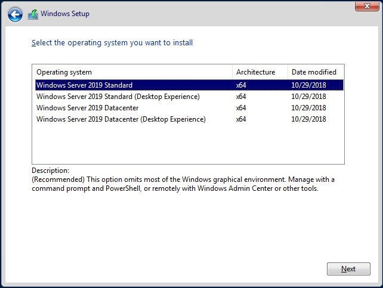

> 第一代虚拟机 vs 第二代虚拟机 	选哪个呢？
>

我在第一次使用HyperV时遇到此问题，抛开两代功能支持范围的不同外。还有个很重要的问题，关系到能不能顺利进入安装界面。

若选择第一代，啥事没有。

若选第二代，则需要关闭`安全启动(Secure Boot)`

具体看这篇文章[How To Solve the Error: Boot failed. EFI SCSI Device in Hyper-V](https://www.danielengberg.com/hyper-v-failed-secure-boot-verification-efi/)

HyperV安装Win Server2019，开启虚拟机后，无法进入安装界面，并且系统英文提示内存过小。或许是由于在HyperV管理器里创建虚拟机的Guidance中，设置的启动内存过低，例如我第一次设置的是512MB，就无法进入管理界面。

安装过程中需要选择OS，请选择`桌面体验`，英文是`Desktop Experience`. 不然，等你安装好后，就会发现是CLI（CMD界面）。

### 激活系统

较新的KMS可以激活Win Server 2019,但拷贝KMS文件前，请先关闭Win自带的防病毒，是否需要关闭防火墙，有待观察。