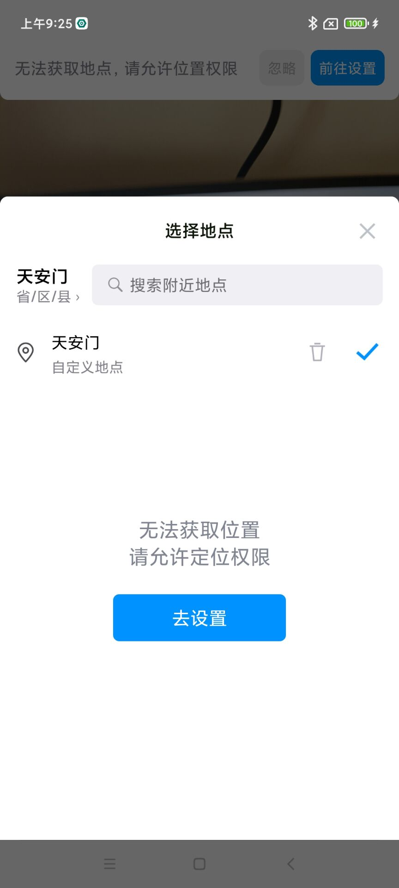
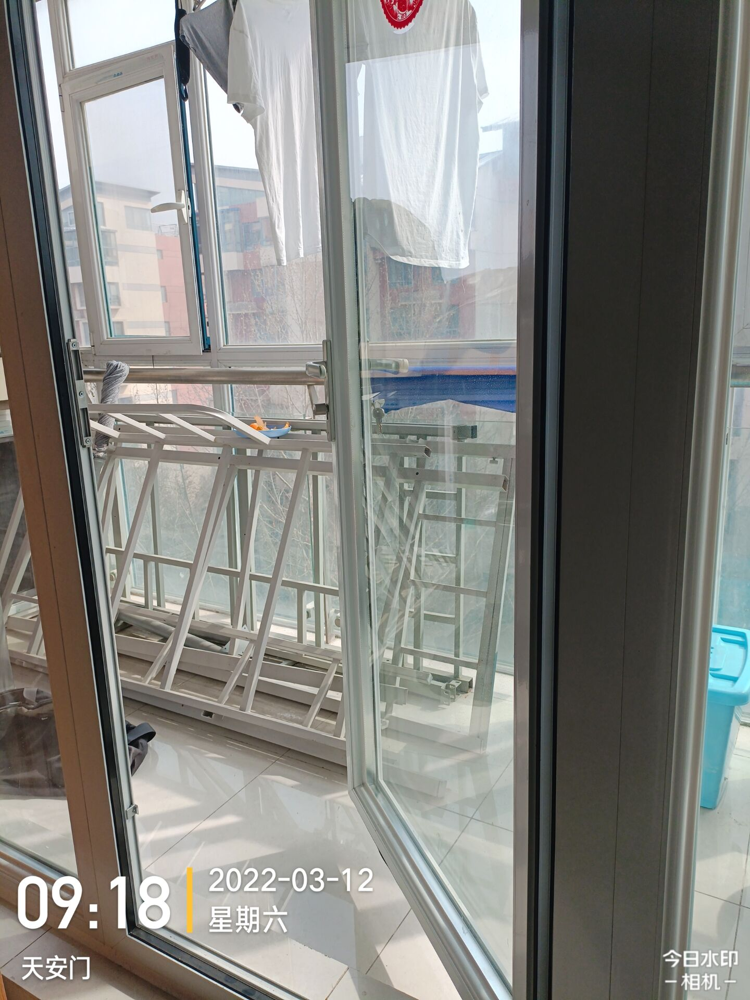
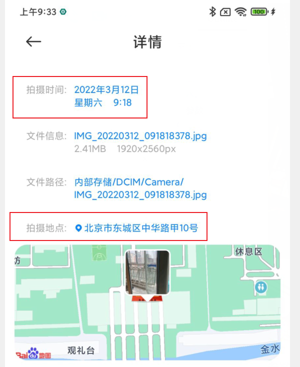

### 需求

只能用今日水印相机拍照，而不能使用原相机。

### 时间

打开设置，关闭“自动确定时间”并修改下方时间;

APP以联网时获取到的时间为最高优先，手机自定义时间其次。那么当APP联网同步过时间后，即使手机设置修改了时间，APP的时间还是不变。那么需要

清除今日水印相机里面的全部数据;

重启APP，可以发现APP时间变成手机修改后的时间了。

### 地点

#### 水印

关闭定位权限;

手动输入地点

#### 参数

需要使用Fake Location来修改。

> 下载链接
>
> https://wwe.lanzoub.com/i7uqi01czdmj
> 密码:g3hw

经过实测，NO Root，小米系手机也可以成功修改参数。

