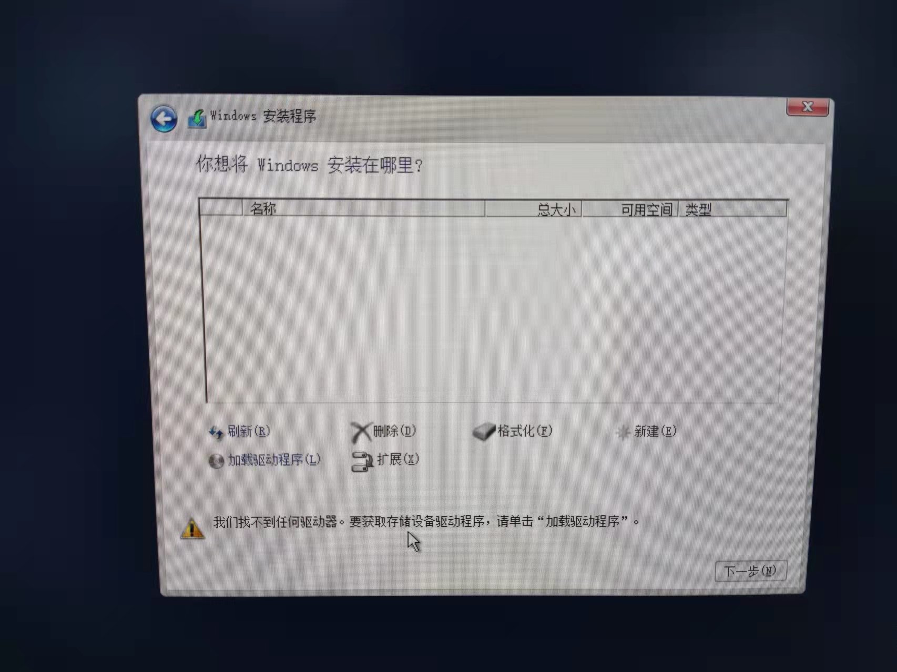
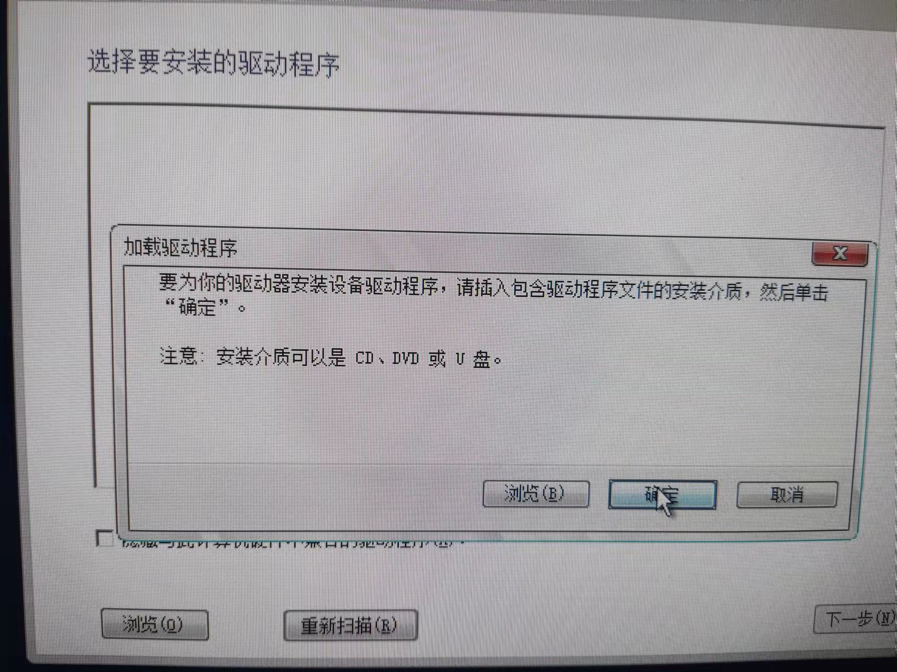
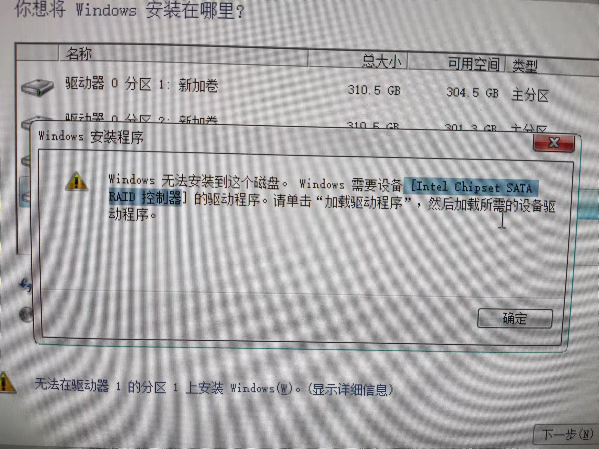
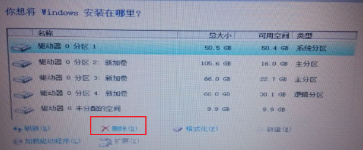

DELL按**F2**进入BIOS。

安装Windows server2016的过程中，由于Dell的Sata Mode默认是Raid On，但我没注意到，∴总是报错。

U盘启动后找不到驱动器

PE环境下安装报错

最好将Sata Mode修改成AHCI，U盘启动后就可以找到驱动器了。但是点击加载驱动程序还是报错。

若目标驱动器没有我们想要保存的文件，那么直接点击删除即可。知乎就可安装系统了。

### IDE MODE 

兼容性较好；*IDE兼容模式是为了保证XP的兼容性，对于win7/win10系统，SSD固态硬盘，AHCI 模式是最佳选择。*

### AHCI MODE 

（Serial ATA Advanced Host Controller Interface）串行ATA高级主控接口/高级主机控制器接口模式，允许存储驱动程序启用高级串行 ATA 功能，可以实现包括NCQ（Native Command Queuing）在内的诸多功能；*较IDE模式使用AHCI模式性能能够提高约20%*。

### RAID MODE 

是在 AHCI MODE 的基础上增加了磁盘的RAID 功能，可能实现磁盘的 RAID 0、RAID 1、RAID 5 等硬盘阵列功能，以提高磁盘的性能或提供硬盘的冗余保护功能；RAID 模式是要有两块以上硬盘才能实现。戴尔的主机默认的SATA模式是Raid on模式，该模式主要是为了当主机拥有多块相同硬盘时而设置的，一般情况下，我们的主机都是由一块SSD和一块机械硬盘组成，所以并不推荐使用Raid on模式。另外，使用Raid on模式安装系统，不仅需要下载额外的驱动，有时还会导致windows无法正常更新，或者安装失败的未知错误，所以在这里推荐安装系统的时候讲BIOS里的SATA模式修改成AHCI模式，这样不仅有利于SSD性能优势的发挥，而且不会产生各种不明错误。