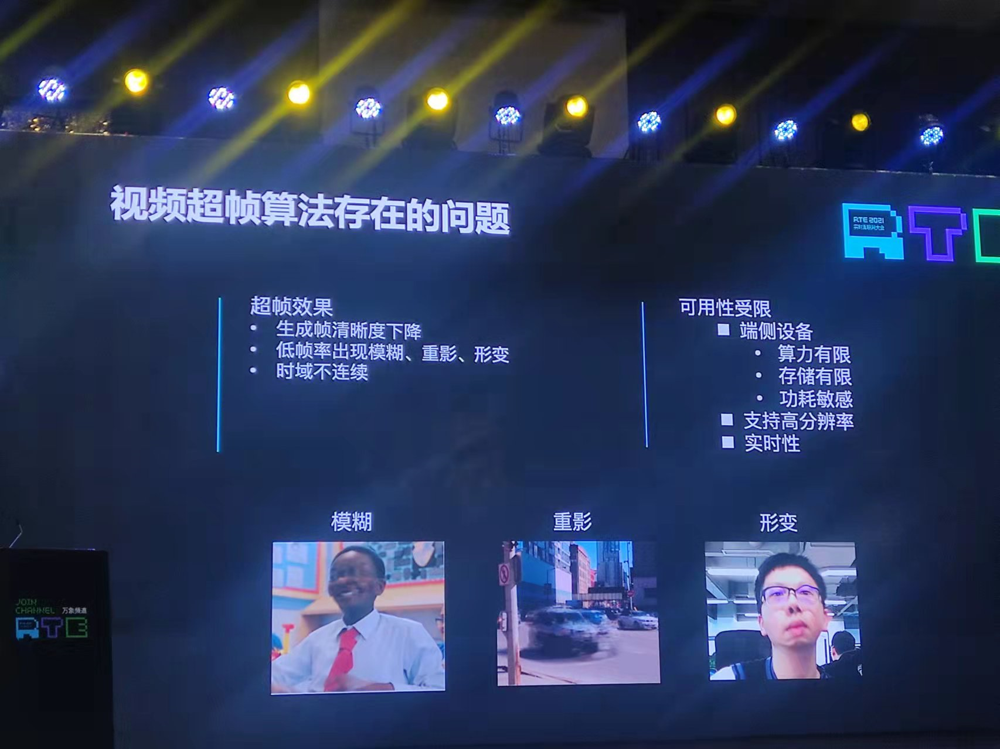

## 超X算法

将服务部署在视频发布者的终端，先通过算法处理，再进行转发。转发后的数据根据保密需要可选择走专线。

## 硬件厂商的解决方案：SD-WAN

深信服WOC设备。

## 比较

两种解决方案各有优劣，适用于不同场景。相比于硬件设备解决方案，算法解决方案对内容发布者更为适合，毕竟对内容订阅者没有太多的限制。

| 思路         | 优势   | 劣势                         |
| ------------ | ------ | ---------------------------- |
| 算法         | 低时延 | 受限于内容发布者终端设备算力 |
| 硬件设备支持 |        | 时延较算法方案较高           |

